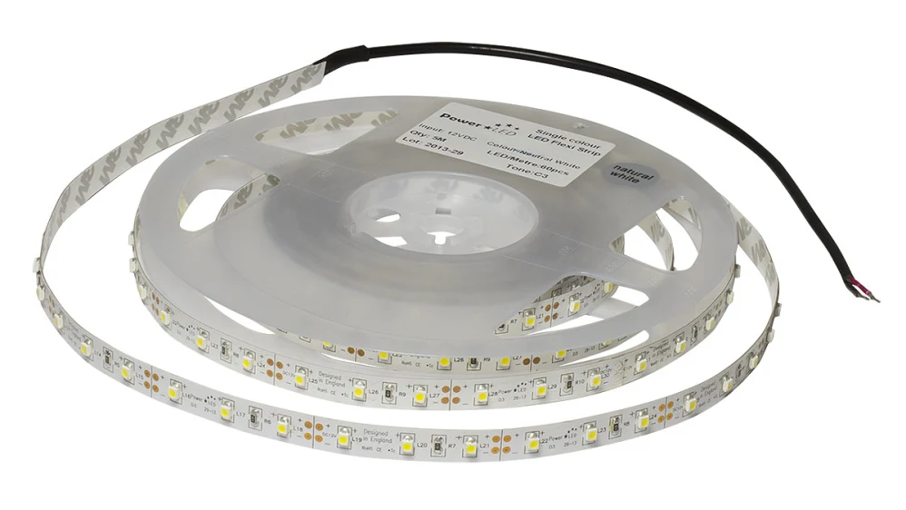
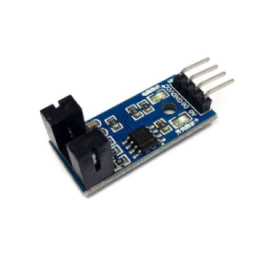

# HDD klok

## Componenten

De uitleg over de componenten die je hieronder terugvindt, bevat informatie terug te vinden in <a href="https://staging.dwengo.org/learning-path.html?hruid=pc_starttodwenguino&language=nl&te=true"><strong>het leerpad StartToDwenguino</strong></a>. Indien je dit nog niet hebt doorlopen of nog extra informatie wilt, kan je <a href="https://staging.dwengo.org/learning-path.html?hruid=pc_starttodwenguino&language=nl&te=true"><strong>hier</strong></a> terecht voor een meer uitgebreide uitleg.

Om met de Dwenguino een theremin te maken, zal je gebruik maken van 4 onderdelen:

- Lcd-scherm
- Servomotor
- Ledstrip
- Snelheidssensor

Hieronder wordt kort beschreven wat de componenten doen en hoe ze eruit zien.

### Lcd-scherm

Het lcd-scherm kan tekst weergeven. Hiermee kan bijvoorbeeld een boodschap worden meegedeeld. 
Op het lcd-scherm van de dwenguino passen maximaal 32 karakters, zoals letters of cijfers, verspreid over twee regels. Je kan dus 16 karakters per regel tonen. 
In deze oefening wordt het LCD-scherm enkel gebruikt om weer te geven dat de microcontroller bezig is met de HDD-klok.

### Servo motor

Een servomotor kan gebruikt worden om beweging te voorzien. 
Er zijn twee soorten: 
     
    - *De blauwe servomotor*: Deze servomotor kan slechts 180 graden draaien. Je kan deze m.a.w. gebruiken om een halve draaibeweging uit te voeren.
    - *De zwarte servomotor*: Deze servomotor kan 360 graden draaien. Deze gebruik je bijvoorbeeld om iets constant te laten draaien. 
     
    Het voordeel van de blauwe servomotor t.o.v. de zwarte servomotor is dat je de positie (de draaihoek) exact kunt bepalen. Hij is dus beter voor precieze bewegingen. Het nadeel is dan weer dat het wat ingewikkelder is om deze te programmeren

Tijdens deze oefening maken we gebruik van een zwarte servomotor die 360 graden kan draaien. We gebruiken deze om de schijf aan een hoge snelheid te laten bewegen.

### Ledstrip

We sluiten bovendien ook een ledstrip aan op de Dwenguino. Een ledstrip is een lint dat meerdere LED-lampjes kan bevatten. We kunnen deze lampjes op hun beurt aansturen om visuele effecten te verkijgen. 
Tijdens deze oefening maken we gebruik van de LED-strip om het gepaste moment een bepaalde kleur te laten schijnen. Zo kan dit in combinatie met de gleuf in de draaiende schijf de illusie geven van klokwijzers.

### Snelheidssensor

De sensor meet de snelheid van een motor door na te gaan in welke mate licht al dan niet doorgelaten wordt. In ons geval gebruikt het de smalle gleuf in de draaiende schijf om de snelheid van de servomotor na te gaan. Doordat we hierdoor de snelheid van de schijf kunnen nagaan weten we ook wanneer bepaalde LED lampjes moeten branden zodat deze een gepast uur kunnen aanduiden. 