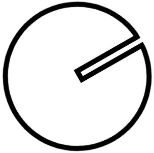

# HDD klok

## Van schijf-snelheid tot juiste LED timing

Als we de snelheidssensor willen gebruiken om de verschillende LED-lampjes op de LED-strip correct aan te spreken, dan moet je de signalen die de sensor stuurt correct gebruiken.
Zoals eerder vermeld zal de snelheidssensor een signaal sturen zodra de infrarood verbinding onderbroken wordt door een object tussen het onderdeel dat een infraroodsignaal verstuurt en het onderdeel dat dit signaal opvangt. 
Om dit te laten gebeuren is het noodzakelijk dat er voorwerp tussen deze twee objecten beweegt dat afwisselend de verbinding toelaat/verbreekt. In deze oefening is dat de draaiende schijf. De schijf zelf laat geen verbinding toe, maar de smalle gleuf wel. Zodra de gleuf voorbij de sensor is en de infraroodverbinding als gevolg onderbroken wordt, zal de sensor een signaal sturen. 

Zodra dit sensorsignaal ontvangen is en we als gevolg weten dat de schijf eenmaal rondgedraaid heeft, kunnen we beginnen berekenen wanneer de LED's moeten branden. 
Een goede timing van de LED's betekend dat de gleuf in de schijf op de juiste positie staat wanneer de LED's branden. Indien dit lukt krijg je namelijk de illusie dat er in de positie van de gleuf een klokwijzer is aangezien het licht enkel hier zichtbaar is. 
Om te bepalen wat de juiste positie is van de gleuf werken we als volgt; we berekenen de verhouding tussen de tijdseenheden van het huidige tijdstip en het maximum van diezelfde tijdseenheden. Deze verhouding passen we vervolgens toe op de duur van een volledige cyclus van de schijf. De verhouding voor bijvoorbeeld 31 minuten is dus 31/60. Dit omdat het huidige aantal minuten 31 is en omdat het maximum aantal minuten op een klok 60 is. 

Concreet zijn dit de berekeningen die gebruiken:
<ul>
    <li>Aantal <b>uren</b> huidig tijdstip / maximaal aantal <b>uren</b> op een analoge klok * tijd voor volledige cyclus van schijf</li>
    <li>Aantal <b>minuten</b> huidig tijdstip / maximaal aantal <b>minuten</b> op een analoge klok * tijd voor volledige cyclus van schijf</li>
    <li>Aantal <b>seconden</b> huidig tijdstip / maximaal aantal <b>seconden</b> op een analoge klok * tijd voor volledige cyclus van schijf</li>
</ul>

Toegepast op een voorbeeld zoals 12 uur, 31 minuten en 10 seconden ziet het er als volgt uit:
<ul>
    <li>12 * 12 / tijd voor volledige cyclus van schijf : op 12/12 van de cyclus van de schijf zullen de leds met de kleur voor uren branden </li>
    <li>31 * 60 / tijd voor volledige cyclus van schijf : op 31/60 van de cyclus van de schijf zullen de leds met de kleur voor minuten branden </li>
    <li>10 * 60 / tijd voor volledige cyclus van schijf : op 10/60 van de cyclus van de schijf zullen de leds met de kleur voor seconden branden </li>
</ul>
Merk op dat we als maximum aantal uren 12 in plaats van 24 gebruiken, een analoge klok gebruikt namelijk maar 12 standen om de uren uit te drukken. 

<!-- Toevoegen link timers & interrupts? -->
De tijd voor een volledige cyclus van de schijf wordt uitgedrukt in ticks. Ticks worden gebruikt als tijdseenheid in de CPU van een computer en de concrete duur is afhankelijk van microcontroller tot microcontroller. 

Deze berekening geeft ons dus een aantal ticks dat we moeten wachten voordat de smalle gleuf in een positie staat die overeenkomt met de positie van een analoge wijzer die het huidig aantal seconden, minuten of uren aangeeft. Hierdoor kunnen we de LED-lichten exact timen om deze te laten branden om deze vervolgens onmiddelijk weer uit te schakelen. Indien we de LED's niet onmiddelijk zouden uitschakelen, zou correct timen van de LED's weinig nut hebben. 

Zoals vermeld in het voorbeeld hebben de LED's ook een verschillende kleur voor seconden, minuten en uren. We kunnen immers geen verschillende lengte's voorzien voor de wijzers in de optische illusie. We gebruiken hiervoor namelijk de gleuf en deze heeft een vaste lengte. Door verschillende kleuren te gebruiken kunnen we alsnog onderscheid maken tussen de verschillende tijdseenheden.

