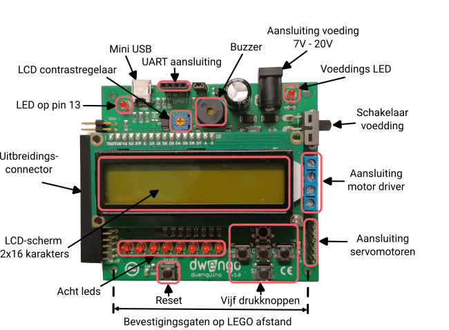
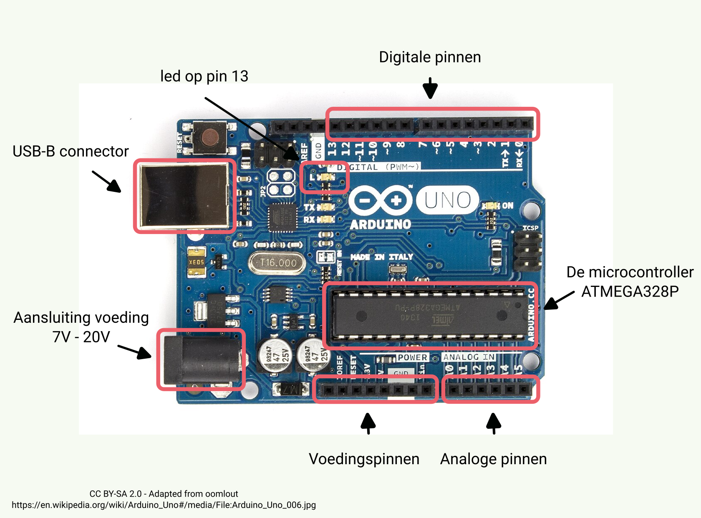

# Inleiding

In deze leerlijn ontdek je hoe microcontrollers allerlei systemen in ons dagelijkse leven controleren. Je gaan hands-on aan de slag met verschillende toepassingen die gebruik maken van een microcontroller (µC). Zo leer je deze microcontrollertoepassingen bouwen en programmeren. Naast deze praktische kennis leer je ook over de werking van de µC. Op die manier verwerf je inzicht in de manier waarop de elektrische schakelingen op de µC gebruikt kunnen worden om taken in ons dagelijkse leven te automatiseren.

## Dankwoord

Deze leerlijn over microcontrollers werd ontwikkeld in het kader van een InnoVET project in samenwerking met GO! Campus De Vesten in Herentals en het GO! Erasmusatheneum in Deinze. Dit lesmateriaal was niet tot stand gekomen zonder de waardevolle input van leerkrachten **Nele Deckx, Frank Desoppere en Geraldine Heyerick**. Verder willen we ook nog de leden van de klankbordgroep bedanken voor hun input en de cel 'iSTEM inkleuren'. Specifiek willen we ook **Kris Werbrouck** bedanken voor de feedback op het lesmateriaal en de koppeling met de leerplandoelen van het KOV. Ook zonder de steun van de Vlaamse overheid hadden we dit materiaal niet kunnen ontwikkelen.

## Hardware
Om deze leerlijn te kunnen doorlopen heb je een microcontrollerplatform nodig. Deze leerlijn bevat voorbeelden voor twee platformen:

1. Het Dwenguino-platform van Dwengo zelf.
2. Het 'Arduino Uno'-platform.

| Het Dwenguino-platform  |
| - |
|  | 
| **Het Arduino-platform** | 
|  |

De basisfunctionaliteiten van het Dwenguino- en Arduino-platform zijn gelijksoortig. De Dwenguino heeft echter een aantal extra functies die het makkelijker maken om in de klas een microcontrollertoepassing te bouwen. 
- De Dwenguino heeft onder andere een lcd-scherm en de mogelijkheid om motoren aan te sturen. Op de Arduino moet je zelf een lcd-scherm aansluiten en moet je, om motoren aan te sturen, gebruikmaken van een externe *motor driver*.
- Daarnaast heeft de Dwenguino ook 9 aanstuurbare leds, een zoemer (of *buzzer*), vijf knoppen en speciale aansluitingen om gemakkelijk DC- en servomotoren aan te sluiten.
- Bovendien kan je de Dwenguino programmeren vanuit de browser zonder software te moeten installeren. Bijgevolg werkt dit op alle platformen: Windows, Linux, macOS, ChromeOS, ...

## Software
De software die je voor deze leerlijn nodig hebt hangt af van het gekozen platform. 
- Leerlingen van de tweede graad maken ofwel gebruik van de Dwengo-simulator op [blockly.dwengo.org](https://blockly.dwengo.org) ofwel van de [Arduino IDE](https://www.arduino.cc/en/software). 
Met de Dwengo-simulator kan je de Dwenguino zowel grafisch (of blokgebaseerd) als tekstueel programmeren. Deze simulator werkt in de browser waardoor je niets hoeft te installeren. 
Met de Arduino IDE kan je de Arduino Uno enkel tekstueel programmeren. Je kan de Arduino IDE makkelijk installeren op Windows, Linux en macOS. 
- In de derde graad kiezen we voor een professionele programmeeromgeving (VSCode) waarmee we zowel de Dwenguino als de Arduino Uno kunnen programmeren. Om dat op een efficiënte manier te kunnen doen maken we gebruik van de [PlatformIO](https://platformio.org/) plugin.
