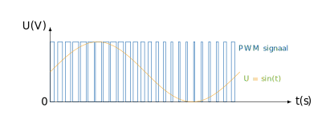

# Analoge uitvoer

De µC kan eigenlijk geen analoge uitvoer genereren. Om in bepaalde situaties zo'n analoge uitvoer te 'simuleren'  kan je gebruik maken van een PWM-signaal. PWM staat voor ***Pulse Width Modulation*** ofwel **pulsbreedtemodulatie**. De microcontroller zal dan pulsen uitsturen. Een puls bestaat uit een tijdsinterval waarin het uitgestuurde signaal 1 (5 V) is en een interval waarin het uitgestuurde signaal 0 is (0 V). Door de breedte van deze twee intervallen te variëren, kan je de verhouding tussen de tijdsduur dat het signaal hoog is en de tijdsduur dat het signaal laag is veranderen. Als je dat heel snel doet dan krijg je een uitgemiddeld signaal tussen de 0 V en 5 V.

<table>
    <tr>
        <td></td>
    </tr>
    <tr>
        <td>Op deze grafiek zie je hoe je aan de hand van een PWM-signaal een analoge waarde kan benaderen. De oranje kromme geeft de spanning weer die in de tijd varieert volgens de functie sin. Om deze te benaderen pas je de breedte van de pulsen aan zodat de gemiddelde waarde van het blauwe PWM-signaal overeenkomt met een bepaalde waarde van sin(t). Wanneer sin(t) hoog is, zullen de pulsen lang hoog blijven (en dus breder zijn). Wanneer de waarde van sin(t) laag is, zullen de pulsen maar heel kort hoog blijven (en dus smaller zijn). Vandaar de naam <strong>pulsbreedtemodulatie<strong>.</td>
    </tr>
</table>

<h2 class="title">Opdracht</h2>
    

        Probeer led 13 op de microcontroller 50 % te dimmen door er een PWM-signaal naar te sturen. Dat PWM-signaal is de helft van de tijd 1 en de andere helft 0.
    

    <h2 class="title">Goed om te weten!</h2>
    

        

        De functie <code class="language-cpp">analogWrite()</code> genereert een PWM-signaal op een pin. Die pin moet je meegeven (<code class="language-cpp">analogWrite(pin)</code>). Deze functie kan je echter enkel gebruiken met een pin die specifieke hardware heeft om een PWM-signaal te genereren. 
            Op elke pin van de µC kan je echter zelf een PWM-signaal genereren door de pin hoog en laag te zetten op de juiste momenten.
        

    

<h2 class="title">Opdracht</h2>
    

        Probeer het effect van het PWM signaal te visualiseren door twee leds naast elkaar te laten branden. Zorg dat de ene led brandt aan volledige intensiteit. Varieer de intensiteit van de tweede led aan de hand van een PWM signaal. Zie je een verschil in intensiteit? 
        Op de Dwenguino kan je LED0 en LED1 gebruiken. Deze zitten op de pinnen 32 en 33.
     

