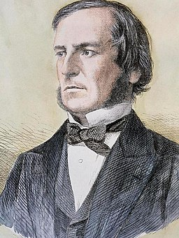

# Logica

Een conditie heeft waar (<code class="lang-cpp">true</code>) of vals (<code class="lang-cpp">false</code>) als resutlaat. In onze code kunnen we ook meerdere condities met elkaar combineren om zo complexere logica te bouwen. Hieronder zie je bijvoorbeeld hoe je twee condities kan combineren om te controleren of een gemeten afstand tussen 100 en 200 centimeter ligt.

<pre>
<code class="lang-cpp">

    if (afstand > 100 && afstand <= 200){
        /*
            Voer deze code uit wanneer de afstand
            tussen 100 en 200 cm ligt.
        */
    }

</code>
</pre>

## Logische operatoren

Er zijn verschillende manieren om condities met elkaar te combineren. Dat doen we aan de hand van **logische operatoren**. In onderstaande tabel zie je een overzicht van de drie logische operatoren die we kunnen gebruiken in c++.

<table>
    <tr>
        <th><strong>Operator</strong></th>
        <th><strong>Naam</strong></th>
        <th><strong>Beschrijving</strong></th>
        <th><strong>Voorbeeld</strong></th>
    </tr>
    <tr>
        <td>&&</td>
        <td>Logische <strong>en</strong></td>
        <td>Waar wanneer zowel de conditie links ervan als die rechts ervan waar zijn.</td>
        <td><code class="lang-cpp">afstand > 100 && afstand <= 200</code></td>
    </tr>
    <tr>
        <td>||</td>
        <td>Logische <strong>of</strong></td>
        <td>Waar wanneer minstens één van de condities waar is.</td>
        <td><code class="lang-cpp">rempedaalIngedrukt || sensorAfstand <= 40</code></td>
    </tr>
    <tr>
        <td>!</td>
        <td>Logische <strong>niet</strong></td>
        <td>Waar wanneer de conditie vals is.</td>
        <td><code class="lang-cpp">!knopIngedrukt</code></td>
    </tr>
</table>

<h2 class="title">Booleaanse algebra</h2>

    

        <table>
            <tr>
                <td rowspan="2">Er is een volledige tak van de wiskunde die zie bezighoudt met hoe je berekeningen kan doen met logische operatoren. Deze tak noemen we de <strong>booleaanse algebra</strong>. De booleaanse logica is genoemd naar George Boole. Hij bedacht de logische operatoren om op een eenvoudigere manier te kunnen redeneren over het gedrag van elektrische schakelingen. </td><td></img></td>
            </tr>
            <tr>
                <td>George Boole. <em>Rechtenvrije afbeelding, via Wikimedia Commons</em></td>
            </tr>
        </table>
    

    

        De booleaanse algebra legt een aantal rekenregels vast waarmee je logische expressies kan omvormen en vereenvoudigen. Een van de rekenregels zijn de wetten van De Morgan. Hieronder zie je een voorbeeld van de wetten van de morgan.
        <pre>
<code class="lang-cpp">
        !(a || b) == !a && !b
        !(a && b) == !a || !b            
</code>
        </pre>
    

