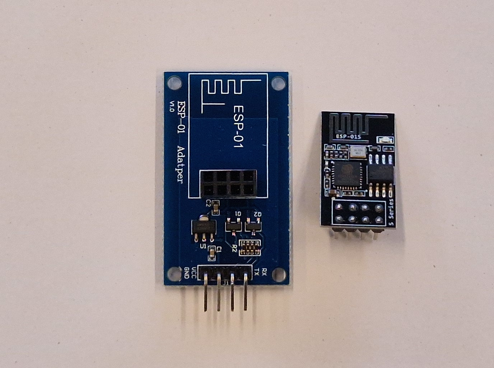

# De wifi module

De Dwenguino heeft standaard geen manier om verbinding te maken met het internet. Toch kan je dat makkelijk doen door er een wifi module mee te verbinden. Wij maken gebruik van de **ESP-01** module. Op deze module zit een **ESP-8266** chip die de verbinding met het wifi netwerk zal uitvoeren. Hieronder zie je een afbeelding van links de ESP-01 module en rechts de ESP-8266 chip met antenne. Je kan de ESP-8266 makkelijk inpluggen op de ESP-01 module.

## Aansluiten op de Dwenguino

De **ESP-01** kan via **UART** spreken met de Dwenguino. Om de module met de Dwenguino te verbinden heb je dus vier male-female draden nodig. Deze kan je verbinden volgens de volgende tabel. Gebruik daarvoor de connector boven het lcd-scherm op de Dwenguino.

<table>
    <tr>
        <th>Dwenguino</th>
        <th>ESP-01</th>
    </tr>
    <tr>
        <td>+</td>
        <td>VCC</td>
    </tr>
    <tr>
        <td>-</td>
        <td>GND</td>
    </tr>
    <tr>
        <td>TX</td>
        <td>RX</td>
    </tr>
    <tr>
        <td>RX</td>
        <td>TX</td>
    </tr>
</table>

