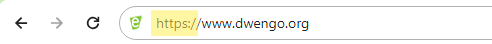

# Webserver

Hier configureren we de Dwenguino als een **webserver**. Dit is een apparaat dat verbonden is met het internet en constant luistert naar inkomende berichten. Wanneer de server een bericht ontvangt, zal deze het bericht verwerken en een antwoord sturen naar de verzender van het bericht. Een webserver verwacht dat berichten een specifiek formaat hebben. Dit formaat wordt vastgelegd in de **HTTP** standaard. HTTP heeft een aantal berichttypes een aantal voorbeelden zijn **GET**, **POST** en **PUT**. 

<h2 class="title">HTTP is overal</h2>

Je maakt dagelijks gebruik van de HTTP standaard wanneer je surft op het internet of apps op je telefoon gebruikt. In je internetbrowser kan je dat duidelijk zien omdat elke url in het begin aangeeft dat een website opgevraagd moet worden via het HTTP procotol.

</img>

Merk op dat websites tegenwoordig meestal **HTTPS** gebruiken. Hier staat de **S** voor **secure** ofwel **beveiligd**. **HTTPS** voegt een extra laag toe bovenop HTTP waarin de gegevens versleuteld zullen worden. Zo kunnen mensen die het bericht onderscheppen de inhoud ervan niet lezen.

