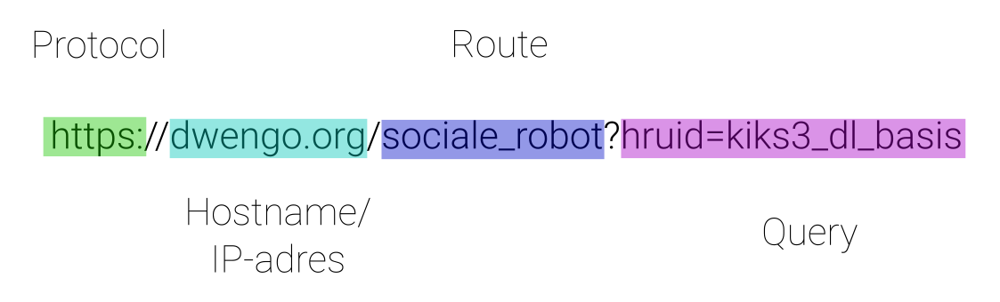
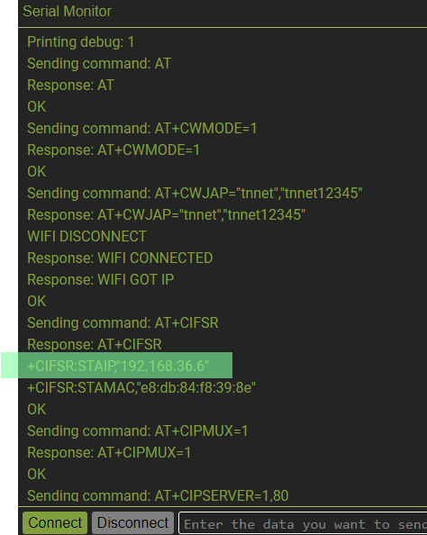

# De Dwenguino als webserver

Hier gaan de de Dwenguino gebruiken als webserver. De Dwenguino zal dus constant via wifi luisteren naar HTTP berichten. Wanneer er een bericht toekomt, zal de Dwenguino het verwerken en een antwoord terugsturen.

## Een wifi netwerk

Voor we de Dwenguino met het netwerk kunnen verbinden, hebben we dus een wifi netwerk nodig. Op veel scholen is een wifi netwerk aanwezig dit netwerk kan je gebruiken om de Dwenguino mee te verbinden. Op veel scholen wordt het wifi netwerk echter sterker beveiligd. Dit kan ervoor zorgen dat je bijvoorbeeld enkel met een specifieke account kan verbinden met het netwerk of dat bepaalde berichten geblokkeerd worden. In dat geval kan je gebruik maken van een **smartphone met een mobiel hotspot**. Deze hotspot zal een eigen netwerk opzetten waarmee je zowel de Dwenguino als je computer kan verbinden. Jij hebt de controle over dit netwerk, zo is het makkelijker om alles correct in te stellen.

## Code voor de webserver

Hieronder zie je een basisprogramma waarmee je de Dwenguino kan gebruiken als webserver. In de commentaar staat uitgelegd wat de verschillende onderdelen van de code doen. De code zal verbinden met een wifi netwerk en ervoor zorgen dat de Dwenguino luistert naar HTTP berichten. Wanneer deze naar de */led* url gestuurd worden, zal de Dwenguino LED13 aan of uit zetten.

    <pre>
<code class="language-cpp" data-filename="filename.cpp">

// Importeer de Dwenguino bibliotheken
#include <Dwenguino.h>
#include <DwenguinoWIFI.h>

// Wi-Fi gegevens
/* 
   Zorg ervoor dat je hier de naam
   en het wachtwoord van je wifi netwerk
   correct aanvult.
*/

const char* ssid = "Naam-van-het-wifi-netwerk";
const char* password = "Wachtwoord-van-het-wifi-netwerk";

// Hierin slaan we de huidige waarde van LED13 op.
unsigned char ledValue = 0;

/*
    Hier initialiseren we de DwenguinoWIFI bibliotheek.
    Deze krijgt de volgende parameters mee:
      - ssid: de naam van het wifi netwerk.
      - password: het wachtwoord van het wifi netwerk.
      - true: Zal ervoor zorgen dat er debug informatie
              over de netwerkverbinding wordt doorgestuurd
              naar de computer via de seriële poort.
              Je kan deze gegevens dan lezen in de 
              seriële monitor.

*/

DwenguinoWIFI DwenguinoWIFI(ssid, password, true);

/*
  Deze functie zal een http bericht verwerken. 
  We noemen een dergelijke functie een "handler" functie.
  Deze heeft de volgende parameters:
    - query: De parameters die achter de url komen. 
             Deze komen na het ? in de url.
             Bv. voor de volgende url
             dwengo.org?hruid=kiks3_dl_basis
             is de query
             hruid=kiks3_dl_basis
    - result: Een string variabele waarin je het resultaat
              dat teruggestuurd moet worden, kan kopiëren.
*/

void handleLEDToggle(char* query, char* result){
  ledValue ^= 1;
  digitalWrite(13, ledValue);
  strcpy(result, String(ledValue).c_str());
}

void setup() {
  // Start seriële communicatie voor debug info.
  Serial.begin(9600);  

  // Wacht 5s zodat je de seriële monitor kan opstarten.
  delay(5000);

  // Initialiseer de Dwenguino.
  initDwenguino();

  // Stel LED13 in als output.
  pinMode(13, OUTPUT);
  // Zet LED13 uit.
  digitalWrite(13, ledValue);

  /*
    Hier voegen we een route toe aan de webserver. We leggen
    hier eigenlijk vast hoe een url verwerkt moet worden door
    de Dwenguino.
      - De eerste parameter zal bepalen naar welke url er 
        geluisterd wordt. In dit geval ip_adres/led.
      - De tweede paramter verwijst naar de fuctie die het
        bericht moet verwerken. Hier de handleLEDToggle functie.
  */

  DwenguinoWIFI.routeManager.addRouteHandler("led", handleLEDToggle);
  
  // Initialiseer de wifi module
  DwenguinoWIFI.setupESP();

  Serial.println("Setup complete");
}

// Luister elke seconde of er een bericht ontvangen is.
void loop() {
  delay(1000);
  Serial.println("Ready to receive http requests.");
  DwenguinoWIFI.handleHTTPRequest();
}

</code>
    </pre>

## Route, query en handler

Er zijn drie belangrijke concepten die je moet begrijpen om je eigen webserver te kunnen bouwen zijn **routes**, **queries** en **handlers**. Routes en queries kunnen we makkelijk illustreren aan de hand van een voorbeeld url. De route en de query komen op het einde van de url. Deze informatie zegt aan de webserver hoe deze de request moet verwerken. De route legt vast door welke functie de request verwerkt zal worden. De query bevat de parameters die deze methode krijgt.

Op de webserver koppelen we een functie aan een route. Deze functie zal berichten met deze route verwerken. Zo'n functie noemen we een **handler** functie. De koppeling tussen route en handler gebeurd met de volgende lijn code.

<pre>
<code class="language-cpp" data-filename="filename.cpp">

  DwenguinoWIFI.routeManager.addRouteHandler("led", handleLEDToggle);

</code>
</pre>

De handler zal dan berichten verwerken. Daarvoor krijgt deze twee parameters. De **query**, deze bevat extra parameters in key=value formaat. Het **result** buffer, dit is een string variabele waar je het antwoord naartoe kan kopiëren. 

<pre>
<code class="language-cpp" data-filename="filename.cpp">

void handleLEDToggle(char* query, char* result){
  ledValue ^= 1;
  digitalWrite(13, ledValue);
  strcpy(result, String(ledValue).c_str());
}

</code>
</pre>

## Berichten sturen naar de Dwenguino

Door bovenstaande voorbeeldcode te uploaden naar de Dwenguino zal deze in staat zijn om te verbinden met je lokaal wifi netwerk. Bovendien zal de Dwenguino luisteren naar HTTP requests en bij een request naar de route *led*, LED13 van toestand veranderen. Voor we HTTP request kunnen sturen naar de Dwenguino, moeten we het IP-adres kennen. Daarvoor moeten we de informatie lezen die de Dwenguino verstuurd naar de seriële monitor. Voer daarvoor de volgende stappen uit:

- Zorg ervoor dat je bovenstaande code hebt geüpload naar de Dwenguino. Let op dat je de naam en het wachtwoord van het wifi netwerk correct ingevuld hebt.
- Zorg dat de Dwenguino met de usb-kabel verbonden is met de computer.
- Zorg dat je in de Dwengo simulator de seriële monitor kan zien. Bekijk indien nodig het [leerpad over de seriële monitor](https://dwengo.org/learning-path.html?hruid=pc_leerlijn_seriele_monitor&language=nl&te=true&source_page=%2Fphysical_computing%2F&source_title=%20Physical%20computing#leerlijn_microcontrollers_seriele_monitor_introductie;nl;1).
- Druk op de reset knop van de Dwenguino en zorg ervoor dat je binnen de 5 seconden verbinding maakt met het bord vanuit de seriële monitor. Zo ben je zeker dat je geen berichten gemist hebt.
- Je ziet informatie over de verbinding met het netwerk. Ga op zoek naar een lijn die start met **+CIFSR:STAIP**. Daar zie je het IP-adres staan. Het IP-adres bevat vier cijfers die gescheiden worden door een punt (bv. 192.168.36.6).

Nu we het IP-adres kennen, kunnen we vanop de computer berichten sturen naar de Dwenguino.