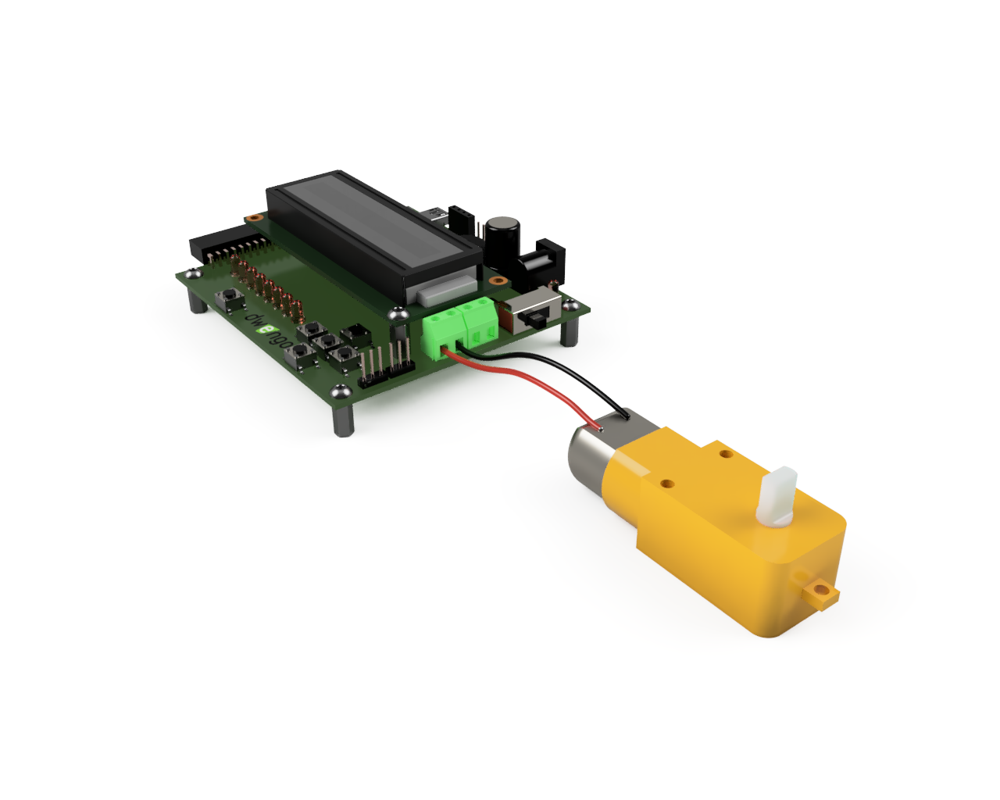
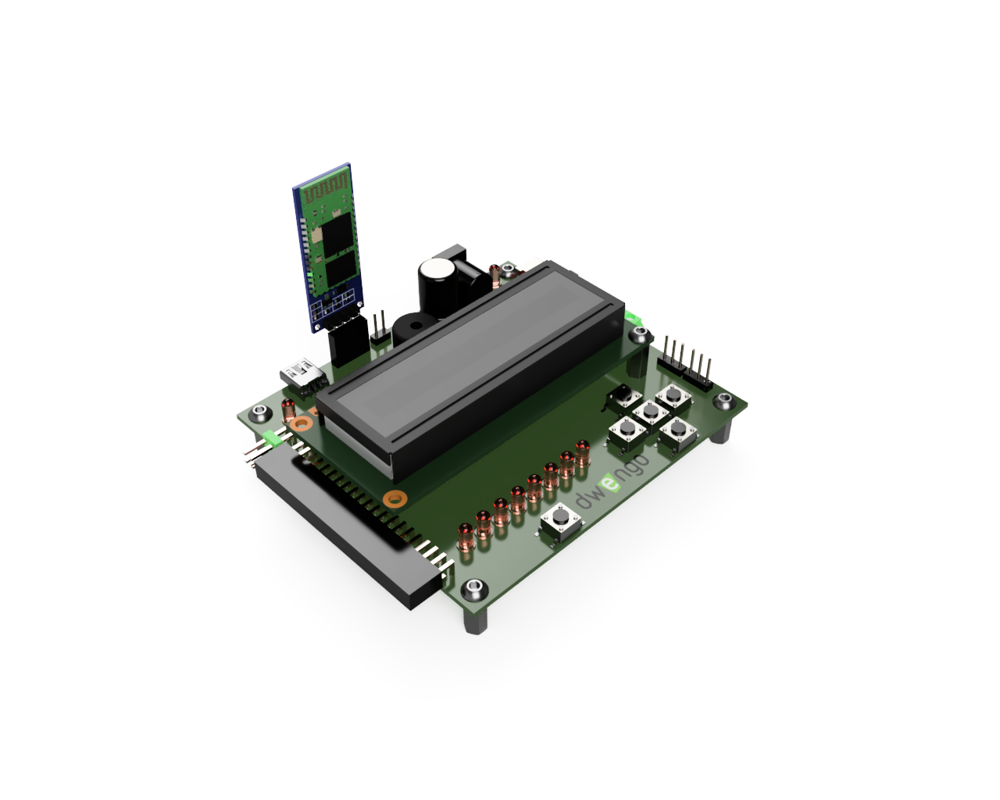

# Het ontwerp

Om de robot makkelijk te kunnen bouwen in de klas, ontwierpen we bij Dwengo een frame dat je makkelijk kan 3D printen. Je kan het ontwerp <a href="/assets/files/physical_computing/chassis_v6.stl">hier</a> downloaden. Het bestand bevat een 3D model in STL formaat. Dergelijke modellen kan je importeren in de slicer software van je 3D printer. Zo kan je de gepaste G-code genereren om het ontwerp op jou printer te printen.

## Bouwen van de robot

Hieronder zie je een afbeelding van hoe je de robot in elkaar moet steken. Probeer op basis van de afbeelding de onderdelen correct te verbinden met de nodige bouten en moeren. Maak **eerst de motoren en sensoren vast** aan het frame. Daarna kan je de Dwenguino vastmaken.

</img>

TODO: filmpje bouwen.

## Aansluiten van de elektronica

Onze rijdende robot heeft maar drie verschillende soorten van elektronische componenten. DC-motoren, grondsensoren en een Bluetooth module. Hieronder beschrijven we hoe je elke component kan aansluiten op de dwenguino.

### De motoren

DC-motoren hebben twee draden. Deze moet je verbinden met de groene schroefterminal aan de rechterkant van het Dwenguino bord. De draden van de linkse motor sluit je aan op de linkse twee schroefterminals. De draden van de rechtse motor, op de rechtse twee schroefterminals. De volgorde van de draden van een motor maakt niet uit, het zal wel bepalen in welke richting de motor zal draaien. Hieronder zie je een voorbeeld van hoe je een motor moet aansluiten.

</img>

### De grondsensoren

De grondsensoren hebben vier pinnen waarvan we er **drie** zullen gebruiken, de \\(\mathrm{VCC}\\), \\(\mathrm{GND}\\) en \\(\mathrm{A0}\\). De \\(\mathrm{D0}\\) pin gebruiken we in dit project niet. Via zowel \\(\mathrm{A0}\\) als \\(\mathrm{D0}\\) pin kan je de gemeten waarde lezen. Op de \\(\mathrm{A0}\\) pin krijg je een analoge waarde (een spanning tussen \\(0\mathrm V\\) of \\(5\mathrm V\\)). Op de \\(\mathrm{D0}\\) krijgen we een digitale waarde (dus \\(0\mathrm V\\) of \\(5\mathrm V\\)). De sensor bekomt de digitale waarde door een grenswaarde op te leggen op de gemeten analoge waarde. Deze grenswaarde kan je instellen met de variabele weerstand op de sensor. Wij kiezen ervoor om de analoge waarde te lezen en de grenswaarde in te stellen in onze code. Zo moeten we niet voor elk oppervlak de sensoren opnieuw bijstellen.

Hieronder zie je een schema van hoe je een sensor kan aansluiten op de µC. We kiezen er in dit project voor om de sensoren aan te sluiten op de analoge pinnen van de µC (\\(\mathrm{A0}\\), \\(\mathrm{A1}\\), \\(\mathrm{A2}\\), \\(\mathrm{A3}\\), \\(\mathrm{A4}\\), \\(\mathrm{A5}\\)). Probeer de sensoren aan te sluiten op de correcte pinnen. Baseer je hiervoor op onderstaand voorbeeld van hoe je een sensor op pin \\(\mathrm{A0}\\) aansluit.

</img>

### De Bluetooth module

Op de Dwenguino is een UART connector voorzien. Dit zijn 4 vrouwelijke pin connectoren aan de bovenkant van het bord. Hierop kan je makkelijk een Bluetooth module aansluiten (bv. de HC-06). Hieronder zie je een voorbeeld van hoe je de module kan aansluiten. **Kijk zeker goed** dat de \\(\mathrm{VCC}\\) en \\(\mathrm{GND}\\) pinnen op de module overeenkomen met respectivelijk de \\(\mathrm{+}\\) en \\(\mathrm{-}\\) pinnen op de Dwenguino.

</img>

### Een batterij

Om de robot van stroom te voorzien en autonoom te laten rijden, heb je een batterij nodig. De Dwenguino kan je op twee mogelijke manieren voeden. Ofwel via de barrel jack rechtsboven op het bord ofwel via de mini-USB poort linksboven op het bord. Via de barrel jack kan je een batterij van \\(7\mathrm V\\) tot \\(20\mathrm V\\) aansluiten. Op de mini-USB poort kan je een powerbank aansluiten. Deze werkt op \\(5\mathrm V\\). 