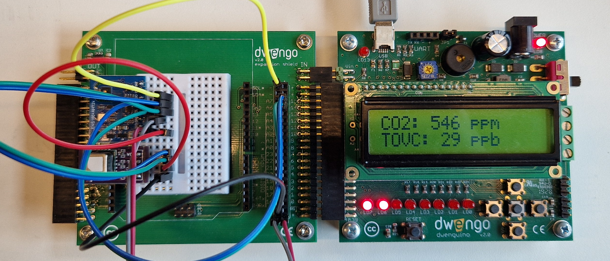

# Introductie

In dit leerpad leer je hoe je een IoT apparaat kan bouwen dat de luchtkwaliteit meet. Hiervoor maken we gebruik van twee sensoren en een wifi module. De sensoren zullen we inzetten om verschillende parameters van de luchtkwaliteit te meten, bijvoorbeeld giftige gassen, CO2, temperatuur en luchtvochtigheid. Aan de hand van de wifi module, kunnen we de gegevens opvragen vanop de computer en ze zo weergeven in een online dashboard.

