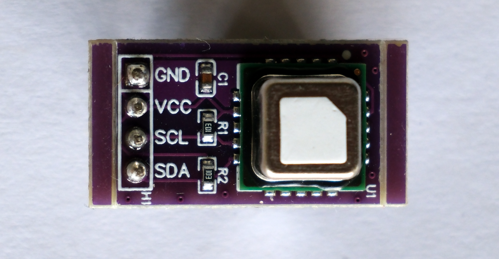

<h1>CO2, temperatuur en luchtvochtigheid</h1>

Om CO2, temperatuur en luchtvochtigheid te meten, gebruiken we een SCD40 sensor. Deze sensor werkt aan de hand van I²C. Hieronder zie je een afbeelding van de sensor.

## Aansluiten van de sensor

Je kan de SCD40 op de volgende manier aansluiten op de Dwenguino.

<table>
    <tr>
        <th>Dwenguino</th>
        <th>SCD40</th>
    </tr>
    <tr>
        <td>+</td>
        <td>VCC</td>
    </tr>
    <tr>
        <td>-</td>
        <td>GND</td>
    </tr>
    <tr>
        <td>15</td>
        <td>SDA</td>
    </tr>
    <tr>
        <td>14</td>
        <td>SCL</td>
    </tr>
    <tr>
        <td>-</td>
        <td>ADO</td>
    </tr>
</table>

## Waarden lezen via de seriële monitor

    <pre>
<code class="language-cpp" data-filename="luchtkwaliteit_serieel.cpp">

    // Bibliotheken inladen.
    #include <Dwenguino.h>
    #include <SensirionI2CScd4x.h>
    #include <Wire.h>

    SensirionI2CScd4x scd4x;

    void setup() {
        initDwenguino();

        // Start de seriële communicatie.
        Serial.begin(9600);
        while (!Serial) {
            delay(100);
        }

        // Initialiseer I²C
        Wire.begin();
        scd4x.begin(Wire);

        unsigned int error;
        char errorMessage[256];

        // Stop metingen om sensor te resetten.
        error = scd4x.stopPeriodicMeasurement();
        if (error) {
            Serial.print("Fout bij stoppen: ");
            errorToString(error, errorMessage, 256);
            Serial.println(errorMessage);
        }

        // Start periodieke metingen.
        error = scd4x.startPeriodicMeasurement();
        if (error) {
            Serial.print("Fout bij starten periodieke metingen: ");
            errorToString(error, errorMessage, 256);
            Serial.println(errorMessage);
        }

        Serial.println("Wachten op eerste meting... (5 sec)");
    }

    void loop() {
        unsigned int error;  // Foutstatus
        char errorMessage[256]; // Foutmelding

        delay(100);

        // Lees sensorwaarden.
        unsigned int co2 = 0;
        float temperature = 0.0f;
        float humidity = 0.0f;
        bool isDataReady = false;

        // Wacht tot data klaar is.
        error = scd4x.getDataReadyFlag(isDataReady);
        if (error) {
            Serial.print("Fout bij opvragen status: ");
            errorToString(error, errorMessage, 256);
            Serial.println(errorMessage);
            return;
        }
        // Start meting wanneer sensor klaar is.
        if (isDataReady) {
            // Doe een meting.
            error = scd4x.readMeasurement(co2, temperature, humidity);
            if (error) {
                Serial.print("Fout bij het meten: ");
                errorToString(error, errorMessage, 256);
                Serial.println(errorMessage);
            } else if (co2 == 0) {
                Serial.println("Foute meting, sla over.");
            } else {
                Serial.print("CO2:");
                Serial.print(co2);
                Serial.print("ppm\t");
                Serial.print("Temperatuur:");
                Serial.print(temperature);
                Serial.print("°C\t");
                Serial.print("Vochtigheid:");
                Serial.print(humidity);
                Serial.println("%");
            }
        }  
    }

</code>
    </pre>

<h2 class="title">Opdracht</h2>

  <ul>
    <li>Sluit de SCD40 sensor aan op de Dwenguino.</li>
    <li>Open bovenstaande voorbeeld in de Dwengo simulator, compileer de code en zet deze over naar de Dwenguino.</li>
    <li>Bekijk de uitvoer van de sensor in de seriële monitor.</li>
  </ul>

