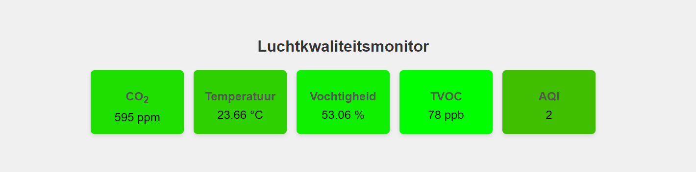

# Een webapplicatie bouwen

Je kan de webinterface not uitbreiden om de data op een mooiere manier weer te geven. Daarvoor is kennis nodig van zowel HTML, CSS en JavaScript. Bij Dwengo bieden we geen diepgaande cursus aan over dit onderwerp omdat daar al heel wat lesmateriaal over bestaad. Toch geven we hier een voorbeeld van waar je met je leerlingen naartoe kan werken. Hieronder zie je een screenshot van de interface die we bouwen.




Deze interface maakt gebruik drie bestanden:
- *index.html*
- *styles.css*
- *script.js*

Maak deze drie bestanden aan in dezelfde map op je computer. Voeg dan aan elk bestand de respectievelijk onderstaande code toe via een teksteditor (bv. kladblok of VSCode). Open daarna het *index.html* bestand met je internetbrowser.

```html
<!DOCTYPE html>
<html lang="en">
<head>
    <meta charset="UTF-8">
    <meta name="viewport" content="width=device-width, initial-scale=1.0">
    <title>Luchtkwaliteitsmonitor</title>
    <link rel="stylesheet" href="styles.css">
    <script defer src="script.js"></script>
</head>
<body>
    <div class="container">
        <h1>Luchtkwaliteitsmonitor</h1>
        <div class="cards">
            <div class="card" id="co2-card">
                <h2>CO<sub>2</sub></h2>
                <p><span id="co2-value">Laden...</span><span> ppm</span></p>
            </div>
            <div class="card" id="temperature-card">
                <h2>Temperatuur</h2>
                <p><span  id="temperature-value">Laden...</span><span> °C</span></p>
            </div>
            <div class="card" id="moisture-card">
                <h2>Vochtigheid</h2>
                <p><span id="moisture-value">Laden...</span><span> %</span></p>
            </div>
            <div class="card" id="tvoc-card">
                <h2>TVOC</h2>
                <p><span  id="tvoc-value">Laden...</span><span> ppb</span></p>
            </div>
            <div class="card" id="aqi-card">
                <h2>AQI</h2>
                <p id="aqi-value">Laden...</p>
            </div>
        </div>
    </div>
</body>
</html>
```


Om de gegevens mooi weer te geven voegen we ook css toe aan de applicatie.

```css
    body {
        margin: 0;
        font-family: 'Arial', sans-serif;
        background: #f0f0f0;
        display: flex;
        justify-content: center;
        align-items: center;
        height: 100vh;
    }

    .container {
        text-align: center;
    }

    h1 {
        color: #333;
        margin-bottom: 20px;
    }

    .cards {
        display: flex;
        justify-content: space-around;
        flex-wrap: wrap;
    }

    .card {
        border-radius: 8px;
        box-shadow: 0 4px 8px rgba(0, 0, 0, 0.1);
        padding: 20px;
        margin: 10px;
        width: 150px;
        transition: transform 0.3s, box-shadow 0.3s;
    }

    .card:hover {
        transform: translateY(-10px);
        box-shadow: 0 8px 16px rgba(0, 0, 0, 0.2);
    }

    h2 {
        color: #555;
        margin-bottom: 10px;
    }

    p {
        font-size: 24px;
        margin: 0;
    }
```

Als laatste voegen we ook JavaScript toe. Deze code zal om de tien seconden een waarde opvragen van de Dwenguino. Deze wordt dan weergegeven in de interface. We mappen de gemeten waarden naar kleuren om zo aan te geven hoe goed of hoe slecht de metingen zijn.

```javascript
    async function getAirQuality() {
        // Stuur GET request naar de Dwenguino
        return fetch('http://192.168.135.6/luchtkwaliteit')
                    .then(response => {
                        if (!response.ok) {
                            throw new Error('Network response was not ok');
                        }
                        return response.text(); 
                    })
                    .then(data => {
                        console.log('Response:', data);  
                        return data;
                    })
                    .catch(error => {
                        throw new Error('There has been a problem with your fetch operation:' + error);
                    });
    }

    // Zet de CSV string om naar afzonderlijke waarden.
    function parseCSV(data) {
        const [co2, temperature, moisture, tvoc, aqi] = data.split(';').map(Number);
        return { co2, temperature, moisture, tvoc, aqi };
    }

    // Bepaal de kleur van de kaart op basis van de waarde.
    function calculateColor(value, min, max, optimal) {
        // Neem groen voor goede waarden, rood voor slechte waarden
        if (value === optimal) return '#00ff00';

        let ratio;
        if (value < optimal) {
            ratio = (value - min) / (optimal - min);
        } else {
            ratio = (max - value) / (max - optimal);
        }

        const red = Math.floor(255 * (1 - ratio));
        const green = Math.floor(255 * ratio);
        return `rgb(${red},${green},0)`;
    }

    // Update de UI met de nieuwe data.
    function updateUI(data) {
        const co2Color = calculateColor(data.co2, 400, 2000, 400);
        const temperatureColor = calculateColor(data.temperature, 0, 40, 20);
        const moistureColor = calculateColor(data.moisture, 0, 100, 50);
        const tvocColor = calculateColor(data.tvoc, 0, 65000, 0);
        const aqiColor = calculateColor(data.aqi, 1, 5, 1);

        document.getElementById('co2-card').style.backgroundColor = co2Color;
        document.getElementById('temperature-card').style.backgroundColor = temperatureColor;
        document.getElementById('moisture-card').style.backgroundColor = moistureColor;
        document.getElementById('tvoc-card').style.backgroundColor = tvocColor;
        document.getElementById('aqi-card').style.backgroundColor = aqiColor;

        document.getElementById('co2-value').textContent = data.co2;
        document.getElementById('temperature-value').textContent = data.temperature;
        document.getElementById('moisture-value').textContent = data.moisture;
        document.getElementById('tvoc-value').textContent = data.tvoc;
        document.getElementById('aqi-value').textContent = data.aqi;
    }

    // Laad de luchtkwaliteitsdata en update de UI.
    async function loadAirQuality() {
        try {
            const csvData = await getAirQuality();
            const airQualityData = parseCSV(csvData);
            updateUI(airQualityData);
        } catch (error) {
            console.error(error);
        }
    }

    // Laad de luchtkwaliteitsdata bij het laden van de pagina.
    document.addEventListener('DOMContentLoaded', loadAirQuality);

    // Laad de luchtkwaliteitsdata elke 10 seconden.
    setInterval(loadAirQuality, 10000); 
```