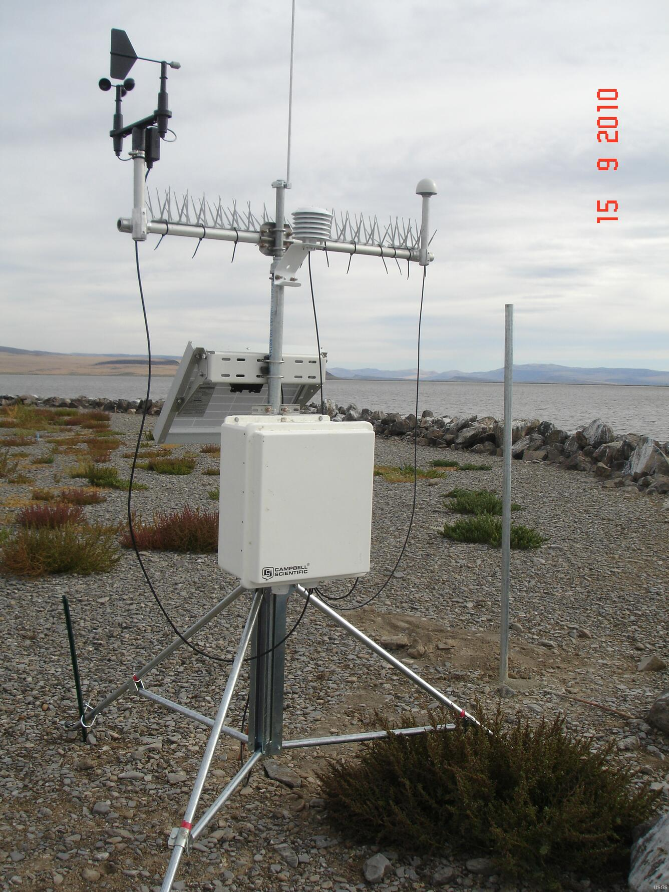

# Het weerstation

Om het hitte-eiland effect in kaart te kunnen brengen, is het nodig om op verschillende plaatsen metingen te kunnen doen. Daarvoor maken wetenschappers gebruik van een weerstation. Zo'n weerstation kan verschillende omgevingsfactoren zoals temperatuur, luchtvochtigheid en luchtdruk meten. 

| Voorbeeld weerstation |
|-|
|  |
| Rechtenvrije afbeelding usgs: https://www.usgs.gov/media/images/remote-weather-station |

## Elektronica

Een weerstation bevat heel wat elektronica: sensoren om omgevingsvariabelen te meten, een microcontroller om de gegevens te verwerken en antennes om gegevens draadloos te versturen naar een centrale databank.

In dit leerpad zal je zien hoe je zelf een weerstation kan bouwen waarmee je het microklimaat op je school in kaart kan brengen. Je weerstation zal gegevens verzamelen over temperatuur, luchtvochtigheid en luchtdruk. Deze gegevens zullen opgeslagen worden op een SD kaartje en kunnen opgevraagd worden via wifi.

Voor het project heb je de volgende componenten nodig:
- Een Dwenguino microcontrollerplatform.
- Een DHT-11 temperatuur- en vochtsensor.
- Een MPL3115A2 luchtdruksensor.
- Een ESP-01 wifi module met ESP8266.
- Een micro-SD kaart module (SPI).
- Een micro-SD kaartje.
- Het Dwenguino breadboard.
- Voldoende kabels om sensoren en modules te verbinden.