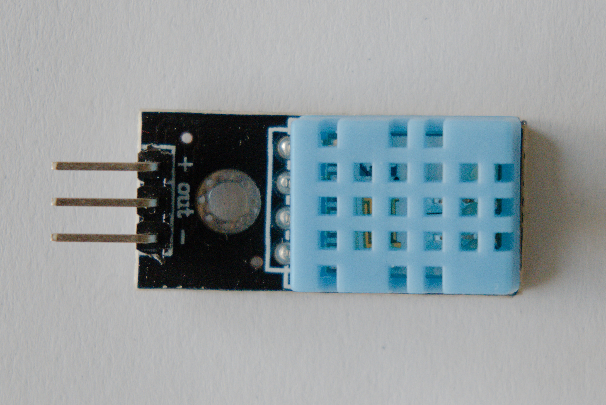

# Temperatuur en luchtvochtigheid

Om de temperatuur en de luchtvochtigheid te meten maken we gebruik van de DHT-11 sensormodule. 

## Aansluiten

Deze kan je eenvoudig aansluiten op de Dwenguino volgens de volgende tabel.

<table>
    <tr>
        <th>Dwenguino</th>
        <th>DHT-11</th>
    </tr>
    <tr>
        <td>+</td>
        <td>+</td>
    </tr>
    <tr>
        <td>-</td>
        <td>-</td>
    </tr>
    <tr>
        <td>3</td>
        <td>OUT</td>
    </tr>
</table>

*De OUT pin van de DHT-11 kan je met gelijk welke pin van de microcontroller verbinden. Wij maken hier de keuze voor pin 3. Wil je een andere pin gebruiken, dan zal je het pinnummer in de voorbeeldcode moeten aanpassen.*

## Programmeren

Hieronder zie je een een codevoorbeeld dat je kan gebruiken om de temperatuur en luchtvochtigheid weer te geven op het lcd-scherm van de Dwenguino.

    <pre>
<code class="language-cpp" data-filename="dht11.cpp">

    #include <LiquidCrystal.h>
    #include <dht.h>    
    #include <Dwenguino.h>

    #define DHT11PIN 3 
    dht DHT; 

    void setup()
    {
        initDwenguino(); 
    }

    void loop()
    {  
        int chk = DHT.read11(DHT11PIN);

        String data_point = String(DHT.temperature)
                            + ";"
                            + String(DHT.humidity);

        dwenguinoLCD.clear();
        dwenguinoLCD.print(data_point);

        delay(1000);
    }

</code>
    </pre>

    <h2 class="title">Opdracht</h2>
    

        <ul>
            <li>Sluit de DHT-11 module aan op de Dwenguino volgens bovenstaande tabel.</li>
            <li>Open de voorbeeldcode in de simulator.</li>
            <li>
                Voeg commentaar toe aan de code waarmee je de volgende onderdelen aanduidt
                    <ul>
                        <li>Het inladen van de DHT bibliotheek.</li>
                        <li>Het declareren van het object voor de DHT sensor.</li>
                        <li>Het uitvoeren van een meting met de DHT sensor.</li>
                    </ul>
            </li>
            <li>Compileer je code en zet die over naar de Dwenguino. Bekijk de uitvoer op het scherm.</li>
            <li>Pas de code aan zodat de gemeten waarde ook via de seriële verbinding naar de computer wordt doorgestuurd.</li>
        </ul>
    

