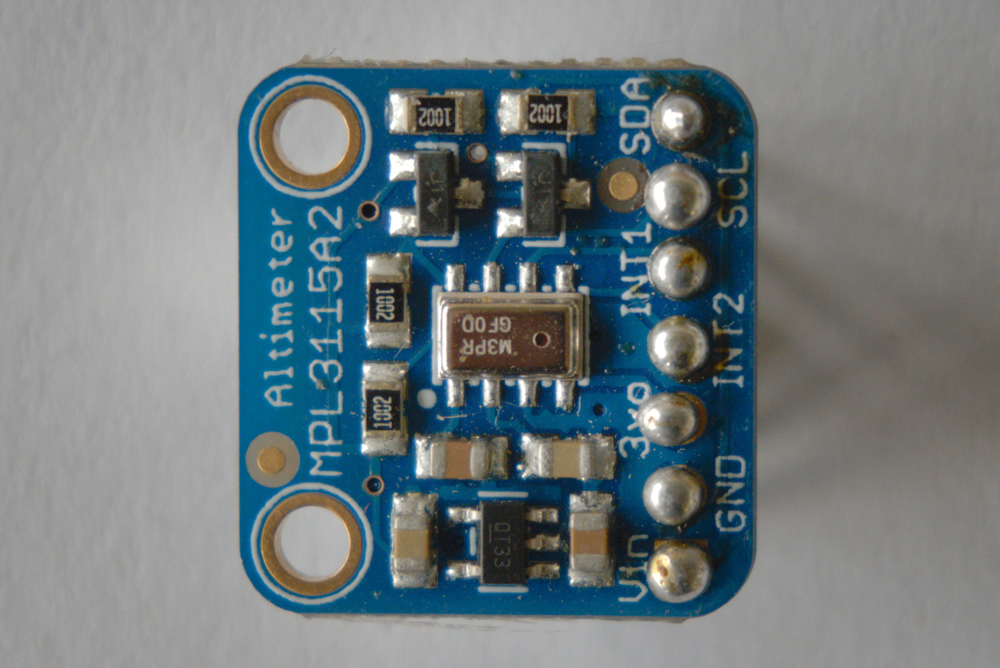

# Luchtdruk

Om de luchtdruk te meten maken we gebruik van de MPL3115A2 chip. We kunnen de waarden van deze chip opvragen via I²C. In dit voorbeeld maken we gebruik van een bibliotheek om deze communicatie voor ons te doen. Wil je meer weten over I²C, neem dan een kijkje in ons [leerpad over bus protocollen](dwengo.org/learning-path.html?hruid=pc_leerlijn_bus_protocollen&language=nl&te=true&source_page=%2Fphysical_computing%2F&source_title=%20Physical%20computing#org-dwengo-pc-bus-protocollen-introductie;nl;1).

## Aansluiting

De volgende tabel geeft weer hoe je de module kan aansluiten.

<table>
    <tr>
        <th>Dwenguino</th>
        <th>MPL3115A2</th>
    </tr>
    <tr>
        <td>+</td>
        <td>VCC</td>
    </tr>
    <tr>
        <td>-</td>
        <td>GND</td>
    </tr>
    <tr>
        <td>15</td>
        <td>SDA</td>
    </tr>
    <tr>
        <td>14</td>
        <td>SCL</td>
    </tr>
</table>

## Programmeren

Onderstaande voorbeeld zal elke seconde een nieuwe waarde opvragen van de MPL3115A2 en deze weergeven op het lcd-scherm van de Dwenguino.

    <pre>
<code class="language-cpp" data-filename="dht11.cpp">
    
    // Bibliotheken inladen
    #include <LiquidCrystal.h>
    #include <Adafruit_MPL3115A2.h>
    #include <Dwenguino.h>

    // Initialiseer de luchtdrukmeter.
    Adafruit_MPL3115A2 mpl;

    void setup()
    {
        initDwenguino(); // Initialiseer de basisfuncties van de Dwenguino
        
        // Test connectie met luchtdrukmeter
        if (!mpl.begin()) {
            dwenguinoLCD.clear();
            dwenguinoLCD.print("ERROR luchtdruk");
            while(1);
        }
    }

    void loop()
    {
        // Sla de luchtdruk op als string.
        String data_point = 
            String(mpl.getPressure());

        // Toon de data op het scherm.
        dwenguinoLCD.clear();
        dwenguinoLCD.print(data_point);

        // Wacht 1s voor je een volgende meting doet.
        delay(1000);
    }

</code>
    </pre>

    <h2 class="title">Opdracht: integratie</h2>
    

        <ul>
            <li>Sluit de MPL3115A2 module aan op de Dwenguino volgens bovenstaande tabel.</li>
            <li>Open de voorbeeldcode in de simulator.</li>
            <li>Compileer je code en zet die over naar de Dwenguino. Bekijk de uitvoer op het scherm.</li>
            <li>
                Integreer de MPL3115A2 en DHT-11 in één toepassing.
                    <ul>
                        <li>Sluit zowel de MPL3115A2 als de DHT-11 aan op de Dwenguino.</li>
                        <li>Combineer de code voor het uitlezen van de sensoren in één programma.</li>
                        <li>Zorg ervoor dat de metingen in csv formaat verstuurd worden naar de computer. Gebruik hiervoor de seriële verbinding.</li>
                    </ul>
            </li>
        </ul>
    

