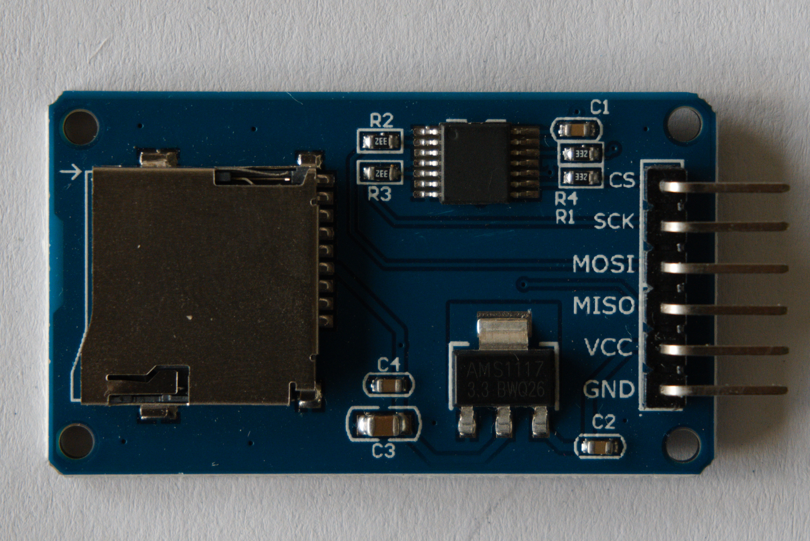

# Gegevens loggen

Om de metingen van het weerstation op te slaan, maken we gebruik van een micro-SD kaartje. Om naar zo'n kaartje te kunnen schrijven, hebben we een SD-kaartlezermodule nodig. Hier maken we gebruik van een eenvoudige SD-kaartmodule die communiceert via SPI. We gebruiken hier een bibliotheek die de SPI communicatie voor ons zal doen. Wil je meer weten over SPI, dan kan je terecht in ons [leerpad over bus protocollen](dwengo.org/learning-path.html?hruid=pc_leerlijn_bus_protocollen&language=nl&te=true&source_page=%2Fphysical_computing%2F&source_title=%20Physical%20computing#org-dwengo-pc-bus-protocollen-introductie;nl;1).

## Aansluiten

<table>
    <tr>
        <th>Dwenguino</th>
        <th>SD module</th>
    </tr>
    <tr>
        <td>+</td>
        <td>VCC</td>
    </tr>
    <tr>
        <td>-</td>
        <td>GND</td>
    </tr>
    <tr>
        <td>12</td>
        <td>MISO</td>
    </tr>
    <tr>
        <td>2</td>
        <td>MOSI</td>
    </tr>
    <tr>
        <td>13</td>
        <td>SCK</td>
    </tr>
    <tr>
        <td>10</td>
        <td>CS</td>
    </tr>
</table>

## Programmeren

Hieronder zie je een codevoorbeeld dat elke seconde de tekst "test" naar een bestand met de naam *weer.txt* op de SD-kaart schrijft. 

    <pre>
<code class="language-cpp" data-filename="sd_card.cpp">
    
    // Bibliotheken inladen
    #include <LiquidCrystal.h> 
    #include <Dwenguino.h>
    #include <OneWire.h>
    #include <SPI.h>
    #include "SD.h"

    // Stel de pinnummers in die op de Dwenguino gebruikt worden voor SPI communicatie.
    const int DW_CS = 10;
    const int DW_MOSI = 2;
    const int DW_MISO = 12;
    const int DW_CLK = 13;

    // Maak een bestand aan 
    File dataFile;

    void setup()
    {
        initDwenguino(); // Initialiseer de basisfuncties van de Dwenguino
  
        // SD kaart verbinding klaarmaken
        dwenguinoLCD.clear();
        dwenguinoLCD.print("SD-kaart setup.");

        // Controleer of de SD-kaart geinitialiseerd kan worden:
        if (!SD.begin(DW_CS, DW_MOSI, DW_MISO, DW_CLK)) {
            dwenguinoLCD.clear();
            dwenguinoLCD.print("Geen SD-kaart?");
            // Geen SD-kaart, blijf wachten.
            while(1);
        }
        dwenguinoLCD.clear();
        dwenguinoLCD.print("Kaart klaar");

        /*
            Maak een bestand op de SD-kaart waar je gegevens naar
            gaat schrijven. LET OP!! De naam van het bestand mag maar
            acht tekens lang zijn bv. 12345678.txt.
        */
        dataFile = SD.open("weer.txt", FILE_WRITE);
        if (!dataFile) {
            dwenguinoLCD.clear();
            dwenguinoLCD.print("Fout bij openen.");
            // Wacht voor altijd: niet mogelijk om data te schrijven.
            while(1);
        }
    }

    void loop()
    {
        // Schrijf een waarde zolang de N(orth) knop niet wordt ingedrukt.
        if (digitalRead(SW_N)){
            // Maak test data aan.
            String data_point = "test";

            // Toon de data op het scherm.
            dwenguinoLCD.clear();
            dwenguinoLCD.print(data_point);

            // Schrijf de data naar het bestand.
            dataFile.println(data_point);

            // Wacht 1s voor je een volgende meting doet.
            delay(1000);

        } else { // Sluit het bestand wanneer de N(orth) knop is ingedrukt.
            dwenguinoLCD.clear();
            dwenguinoLCD.print("closing file");

            // Schrijf de data weg naar het bestand en sluit het bestand.
            dataFile.flush();
            dataFile.close();

            // Stop het programma.
            return;
        }
    }

</code>
    </pre>

    <h2 class="title">Opdracht: integratie</h2>
    

        <ul>
            <li>Sluit de SD-kaart module aan op de Dwenguino volgens bovenstaande tabel.</li>
            <li>Open de voorbeeldcode in de simulator.</li>
            <li>Compileer je code en zet die over naar de Dwenguino. Controller of de testdata correct wordt weggeschreven naar de SD-kaart. Hiervoor heb je mogelijks een SD-klaartlezer voor je computer nodig.</li>
            <li>
                Integreer de SD-kaartlezer met de MPL3115A2 en DHT-11 in één toepassing.
                    <ul>
                        <li>Sluit zowel de kaartlezer, de MPL3115A2 als de DHT-11 aan op de Dwenguino.</li>
                        <li>Combineer de code voor het uitlezen van de sensoren en het wegschrijven van de gegevens in één programma.</li>
                        <li>Zorg ervoor dat de metingen in csv formaat in een bestand op de SD-kaart geschreven worden.</li>
                    </ul>
            </li>
        </ul>
    

