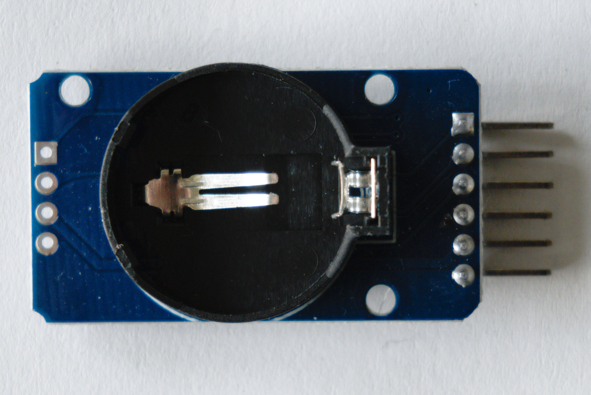

# De real time clock

Zoals je misschien al weet, is de microcontroller zeer goed in exacte tijdsintervallen timen. Daarvoor gebruikt de microcontroller een interne klok met een vaste en zeer precieze klokfrequentie. Toch kan je de microcontroller niet gebruiken om de ware tijd, die je op je uurwerk kan lezen, op te slaan. Telkens je de microcontroller uit zou zetten of de stroom zou wegvallen, weet deze niet meer wat de ingestelde tijd was. Dat is vervelend. Om die reden wordt er vaak een externe module gebruikt om de ware tijd bij te houden. Zo'n module noemen we een **real time clock (RTC)**. Deze module heeft een eigen klok die de tijd nauwkeurig kan meten. Bovendien heeft de module een batterij zodat deze de tijd kan onthouden, zelfs wanneer de stroom wegvalt. Hieronder zie je een afbeelding van een RTC module (zonder batterij).

## Aansluiten

De RTC module maakt gebruik van I²C. Hier maken we gebruik van een bibliotheek die de I²C communicatie voor ons doet. Wil je meer weten over I²C, bekijk dan ons [leerpad over bus protocollen](https://www.dwengo.org/learning-path.html?hruid=pc_leerlijn_bus_protocollen&language=nl&te=true&source_page=%2Fphysical_computing%2F&source_title=%20Physical%20computing#org-dwengo-pc-bus-protocollen-introductie;nl;1).

De volgende tabel geeft weer hoe je de module kan aansluiten.

<table>
    <tr>
        <th>Dwenguino</th>
        <th>RTC</th>
    </tr>
    <tr>
        <td>+</td>
        <td>VCC</td>
    </tr>
    <tr>
        <td>-</td>
        <td>GND</td>
    </tr>
    <tr>
        <td>15</td>
        <td>SDA</td>
    </tr>
    <tr>
        <td>14</td>
        <td>SCL</td>
    </tr>
</table>

**Merk op dat je meerdere apparaten op dezelfde bus kan aansluiten.**

## De tijd instellen

De eerste keer dat we een RTC module gebruiken, moeten we de tijd ervan instellen. Eens we de tijd hebben ingesteld, zal de RTC module deze onthouden. We kunnen die dan telkens terug opvragen.

Om de tijd te kunnen instellen, hebben we bij Dwengo een voorbeeldprograma gemaakt dat een menu toont op het lcd-scherm waarmee je de tijd kan instellen. Door dit programma up te loaden naar de Dwenguino, kan je de tijd van de RTC instellen. Daarna kan je je eigen code uploaden waarin je de tijd kan opvragen. Hieronder zie je de code van dat voorbeeldprogramma. Het is niet de bedoeling dat je al deze code begrijpt. We maken gebruik van concepten die je nog niet gezien hebt zoals interrupts. Wil je meer leren over interrupts, neem dan een kijkje in ons [geavanceerd leerpad over de microcontroller](https://www.dwengo.org/learning-path.html?hruid=pc_leerlijn_g4&language=nl&te=true&source_page=%2Fphysical_computing%2F&source_title=%20Physical%20computing#pc_micro_tei;nl;3).

    <pre>
<code class="language-cpp" data-filename="filename.cpp">

    #include <Dwenguino.h>
    #include <Wire.h>
    #include <DS3231-RTC.h>

    DS3231 mijnRTC;
    RTClib rtcLib;

    String menuItemLabels[] 
        = {"Jaar", "Maand", "Dag", "Dag week", "Uur", "Minuut", "Seconde"};

    unsigned char menuLocatie = 0; 

    const unsigned char AANTAL_MENU_ITEMS = 7;
    const unsigned char JAAR = 0;
    const unsigned char MAAND = 1;
    const unsigned char DAG = 2;
    const unsigned char DVW = 3;
    const unsigned char UUR = 4;
    const unsigned char MINUUT = 5;
    const unsigned char SECONDE = 6;

    unsigned char debounce = 0;

    // De default instelling voor jaar, maand, dag, dVW, uur, minuut en seconde.
    unsigned int tijdsinstelling[AANTAL_MENU_ITEMS] 
        = {24, 7, 5, 5, 12, 0, 0};
    unsigned int tijdsinstellingMaxima[AANTAL_MENU_ITEMS] 
        = {3000, 12, 31, 7, 24, 60, 60};

    // Knop omhoog
    ISR(INT7_vect){
        if (debounce == 0){
            menuLocatie = (menuLocatie + 1)%AANTAL_MENU_ITEMS;
        }
        debounce = 2;
    }

    // Knop rechts
    ISR(INT6_vect){
        if (debounce == 0){
            tijdsinstelling[menuLocatie] = 
                (tijdsinstelling[menuLocatie] + 1)
                %tijdsinstellingMaxima[menuLocatie];
                debounce = 2; 
        }
    }

    // Knop onder
    ISR(INT5_vect){
        if (debounce == 0){
            menuLocatie = (menuLocatie - 1)%AANTAL_MENU_ITEMS;
            debounce = 2; 
        }
    }

    // Knop links
    ISR(INT4_vect){
        if (debounce == 0){
            tijdsinstelling[menuLocatie] = 
                (tijdsinstelling[menuLocatie] - 1)
                %tijdsinstellingMaxima[menuLocatie];
                debounce = 2;
        }
    }

    void zetKnopInterruptsAan(){
        pinMode(SW_N, INPUT_PULLUP);
        pinMode(SW_E, INPUT_PULLUP);
        pinMode(SW_S, INPUT_PULLUP);
        pinMode(SW_W, INPUT_PULLUP);
        SREG |= 1<<SREG_I;  // Zet globale interrupts aan.
        //N,S
        EIMSK |= ((1<<INT7)|(1<<INT6)|(1<<INT5)|(1<<INT4));
        EICRB &= ~((1<<ISC70)|(1<<ISC60)|(1<<ISC50)|(1<<ISC40));
        EICRB |= ((1<<ISC71)|(1<<ISC61)|(1<<ISC51))|(1<<ISC41);
    }

    void zetKnopInterruptsUit(){
        EIMSK &= ~((1<<INT7)|(1<<INT6)|(1<<INT5)|(1<<INT4));
    }

    void printStringNaarLCD(unsigned char rij, unsigned char kolom, String tekst){
        dwenguinoLCD.setCursor(kolom, rij);
        dwenguinoLCD.print(tekst);
    }

    void stelTijdIn(){
        mijnRTC.setClockMode(false);  // 24h klok
            
        mijnRTC.setYear(tijdsinstelling[JAAR]);
        mijnRTC.setMonth(tijdsinstelling[MAAND]);
        mijnRTC.setDate(tijdsinstelling[DAG]);
        mijnRTC.setDoW(tijdsinstelling[DVW]);
        mijnRTC.setHour(tijdsinstelling[UUR]);
        mijnRTC.setMinute(tijdsinstelling[MINUUT]);
        mijnRTC.setSecond(tijdsinstelling[SECONDE]);
    }

    void openTijdsinstellingsmenu(){
        zetKnopInterruptsAan();
        dwenguinoLCD.clear(); // Maak scherm leeg
        
        pinMode(SW_C, INPUT_PULLUP);

        // Toon het menu zolang de SW_C knop niet wordt ingedrukt. 
        while (digitalRead(SW_C)){
            // Teken controls
            printStringNaarLCD(0, 15, '^');
            printStringNaarLCD(1, 15, 'v' - 1);
            printStringNaarLCD(1, 0, "<");
            printStringNaarLCD(1, 7, ">");
            printStringNaarLCD(0, 2, menuItemLabels[menuLocatie]);
            printStringNaarLCD(1, 2, String(tijdsinstelling[menuLocatie]));
            delay(100);
            dwenguinoLCD.clear(); // Maak scherm leeg
            if (debounce > 0){
                debounce--;
            }
        }
        zetKnopInterruptsUit();
    }

    void setup() {
        initDwenguino(); // Initialiseer de basisfuncties van de Dwenguino

        // Start de serial poort
        Serial.begin(9600);
        
        // Start de I2C interface
        Wire.begin();

        // Stel tijd in via waarden RTC
        DateTime now = rtcLib.now();
        tijdsinstelling[JAAR] = now.getYear() - 2000;
        tijdsinstelling[MAAND] = now.getMonth();
        tijdsinstelling[DAG] = now.getDay();
        tijdsinstelling[DVW] = now.getWeekDay();
        tijdsinstelling[UUR] = now.getHour();
        tijdsinstelling[MINUUT] = now.getMinute();
        tijdsinstelling[SECONDE] = now.getSecond();
    }

    void stuurTijdOverSerieel(){
        DateTime now = rtcLib.now();

        Serial.print(now.getYear(), DEC);
        Serial.print('/');
        Serial.print(now.getMonth(), DEC);
        Serial.print('/');
        Serial.print(now.getDay(), DEC);
        Serial.print(' ');
        Serial.print(now.getHour(), DEC);
        Serial.print(':');
        Serial.print(now.getMinute(), DEC);
        Serial.print(':');
        Serial.print(now.getSecond(), DEC);
        Serial.println();
    }

    void loop() {
        printStringNaarLCD(0, 0, "N:Tijd sturen");
        printStringNaarLCD(1, 0, "S:Tijd instellen");
        delay(500);
        dwenguinoLCD.clear(); // Maak scherm leeg

        if (!digitalRead(SW_N)){
            // Stuur tijd door over serieel 
            // wanneer de noord knop wordt ingedrukt.
            stuurTijdOverSerieel();
        } else if (!digitalRead(SW_S)){
            // Stel tijd in via menu.
            openTijdsinstellingsmenu();
            stelTijdIn();
        }    
    }

</code>
    </pre>

    <h2 class="title">Opdracht: integratie</h2>
    

        <ul>
            <li>Sluit de RTC module aan op de Dwenguino volgens bovenstaande tabel.</li>
            <li>Open de voorbeeldcode in de simulator.</li>
            <li>Compileer je code en zet die over naar de Dwenguino.</li>
            <li>Stel de tijd van de RTC in.</li>
            <li>Neem de code voor het uitlezen van de RTC over in je programma die de temperatuur, vochtigheid en luchtdruk leest. Zorg ervoor dat bij elke meting ook steeds de tijd van de meting wordt weggeschreven naar de SD-kaart.</li>
        </ul>
    

