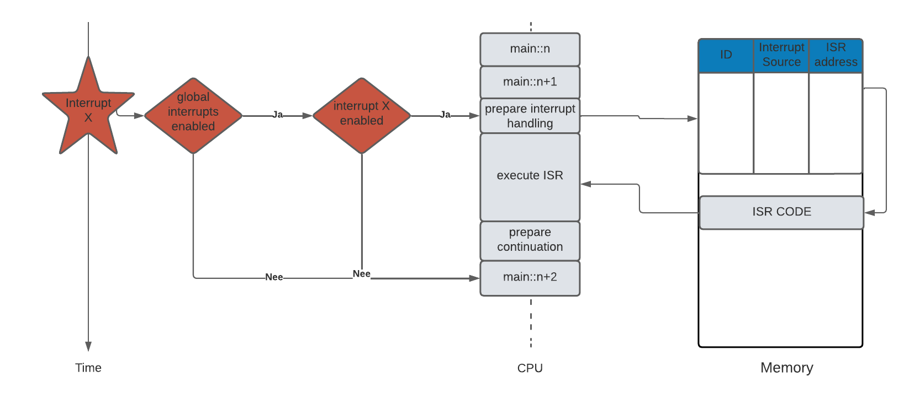

# Practicum 2 - Timers en Interrupts

## Oefening 4: Gebruik van externe interrupts om het indrukken van knoppen te detecteren zonder active polling

Ook interrupts zijn in de kennisclips al behandeld. Lees zeker de relevante delen van de Ufora-pagina nog eens. We tonen hieronder nog eens de overzichtsfiguur: 

    <h2 class="title">Opdracht 4.1</h2>
    

        <h3>Datasheet</h3>
        

            Lees hoofdstuk <strong>12</strong> van de datasheet tot en met <strong>12.0.4</strong> en zoek specifiek naar volgende zaken:
        

        

            <ul>
                <li>Hoe zet je de globale interrupts aan?</li>
                <li>Hoe schakel je een specifieke externe interrupt pin aan?</li>
                <li>Hoe bepaal je welk(e) signaal(veranderingen) op de pin een interrupt veroorzaken?</li>
            </ul>
        

    

    <h2 class="title">Opdracht 4.2</h2>
    

        <h3>Tellen van hoe vaak een knop gedrukt is</h3>
        

            Bij wijze van kennismaking gaan we nu een externe interrupt gebruiken om te tellen hoeveel keer een knop wordt ingedrukt.
        

        

            In de vorige opdracht heb je hopelijk alle stappen in de datasheet kunnen vinden. We herhalen hier nog eens kort de configuratiestappen om een interrupt in te stellen:
        

        

            <ul>
                <li>Het <strong>SREG</strong> register (Status REGister) bevat het globale interrupt enable bit (zie datasheet p.13).</li>
                <li>Het <strong>EIMSK</strong> register (External Interrupt MaSK) kan je gebruiken om de interrupt enable bits in te stellen.</li>
                <li>Het <strong>EICRB</strong> register (External Interrupt Control Register B) gebruik je om te configureren of de interrupt voorkomt bij een rising of falling edge. (Kies voor falling edge, de knop schakelt immers van 1 naar 0 als je hem indrukt)</li>
            </ul>
        

        

            Nu de registers juist zijn ingesteld kunnen we een interrupt-routine schrijven. Rest nog de vraag: welke interrupt willen we exact afhandelen? Je zal op het schema van de dwenguino zien dat er geen interrupt pin is verbonden met de C knop, <strong>zoek daarom welke knop verbonden is met de INT6 pin</strong>.
        

        

            Vergeet ook niet de <strong>INT6 pin van de microcontroller als invoer te configureren</strong> en de pull-up weerstand ervan te activeren!
        

        

            <strong>Schrijf nu de nodige code om op het scherm te tonen hoeveel keer de knop die verbonden is met de INT6 pin ingedrukt werd.</strong>
        

    

    <h2 class="title">Opdracht 4.3</h2>
    

        <h3>Verbeterd meetsysteem</h3>
        

            Pas nu de code van het meetsysteem aan om het indrukken van de knop op te vangen met een interrupt. Gebruik opnieuw de knop die verbonden is met INT6 en doorloop alle stappen uit vorige opdracht. In de ISR lees je nu het TCNT register uit.
        

        

            Vergeet ook niet te checken of de LEDs wel degelijk aan staan wanneer de knop wordt ingedrukt, om foutieve metingen te vermijden.
        

        

            Check of je reactietijden in de buurt liggen van die uit de vorige oefening, anders heb je wellicht een fout gemaakt.
        

    

    <h2 class="title">Waarom ook al weer een interrupts?</h2>
    

        

            Door een interrupt te gebruiken om het indrukken van de knop af te handelen zal het interval zeer exact gemeten kunnen worden én is het timen van de reactietijd volledig onafhankelijk geworden van de code die in de main functie wordt uitgevoerd. Zo kunnen we nu bijvoorbeeld ondertussen op de onderste rij van het lcd een animatie afspelen of andere operaties uitvoeren.
        

    

