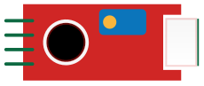
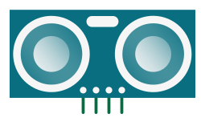
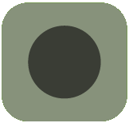
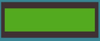

# Soorten pinnen

## Vcc, V+, +

**Vcc** staat voor *Voltage common collector* en geeft aan dat op deze pin een positieve spanning aanwezig is. Afhankelijk van de producent krijgt de **Vcc**  pin ook andere namen zoals V+, Vdd of gewoon +. De meeste elektronische componenten hebben een **Vcc** en **GND** aansluiting. Dit zijn de twee aansluitingen waarmee je de component van stroom voorziet. De **Vcc** aansluiting wordt altijd verbonden met een draad met een positieve spanning (bv. de plus kant van een batterij). Voor verbindingen met de VCC op 5V wordt gewoonlijk een **rode draad** gebruikt. 

## GND, -

De **GND** of **-** aansluiting wordt verbonden met een draad met een neutrale spanning ook wel de referentiespanning genoemd (bv. de min kant van een batterij ofwel 0V). Voor verbindingen met de **GND** wordt gewoonlijk een **zwarte draad** gebruikt. 

## Signaal

Afhankelijk van de component zal die één of meerdere signaalpinnen hebben. Deze pinnen worden gebruikt om informatie uit te wisselen tussen de component en de microcontroller. De naam van deze pinnen hangt af van de component die je gebruikt. Bij eenvoudige componenten met maar één signaalpin is deze informatie meestal binair. Een knop geeft bijvoorbeeld een hoog signaal (5V) op de signaalpin als die ingedrukt is. Wanneer die niet ingedrukt is, dan geeft deze een laag signaal (0V). De kleur van de signaaldraden kies je zelf op basis van welke draden je ter beschikking hebt. Kies kleuren die niet overlappen met Vcc of GND.

Complexere componenten hebben vaak meerdere signaaldraden. Het LCD-scherm dat standaard voorzien is op het Dwenguino bord heeft bijvoorbeeld 12 signaalpinnen. Hieronder zie je een overzicht van een aantal componenten en de uitleg over hun pinnen. Informatie over andere componenten kan je vinden op de componentfiches.

<table>
    <tr>
        <th>
            <strong>Component</strong>
        </th>
        <th>
            <strong>Aansturen of uitlezen</strong>
        </th>
        <th>
            <strong>Pinnen</strong>
        </th>
    </tr>
    <tr>
        <td>
            
Geluidsensor

            </img>
        </td>
        <td>
            Digitaal en analoog uitlezen
        </td>
        <td>
            GND = 0V 
            Vcc = 5V 
            D0 = digitale uitvoer 
            A0 = analoge uitvoer
        </td>
    </tr>
    <tr>
        <td>
            
Sonar-sensor

            </img>
        </td>
        <td>
            Via bibliotheek uitlezen.
        </td>
        <td>
            GND = 0V 
            Vcc = 5V 
            Trig = trigger pin 
            Echo = echo pin
        </td>
    </tr>
    <tr>
        <td>
            
Servomotor

            </img>
        </td>
        <td>
            Via bibliotheek aansturen.
        </td>
        <td>
            GND = 0V 
            Vcc = 5V 
            PWM = PWM pin
        </td>
    </tr>
    <tr>
        <td>
            
Knop

            </img>
        </td>
        <td>
            Digitaal uitlezen.
        </td>
        <td>
            GND = 0V 
            Vcc = 5V 
            OUT = digitale uitvoer.
        </td>
    </tr>
    <tr>
        <td>
            
LCD-scherm

            </img>
        </td>
        <td>
            Via bibliotheek aansturen.
        </td>
        <td>
            GND = 0V 
            Vcc = 5V 
            DB0 = data pin 0 
            DB1 = data pin 1 
            DB2 = data pin 2 
            DB3 = data pin 3 
            DB4 = data pin 4 
            DB5 = data pin 5 
            DB6 = data pin 6 
            DB7 = data pin 7 
            E = Enable 
            R/W = Read/Write 
            RS = Reset 
            LEDK = backlight 
        </td>
    </tr>
    <tr>
        <td colspan=3><strong>Voorbeelden van componenten en hoe ze communiceren met de microcontroller.</strong></td>
    </tr>
</table>

    <h2 class="title">Wist je dat</h2>
    

    Het lcd-scherm is heel handig om fouten in je code op te sporen. Je kan het bijvoorbeeld gebruiken om waarden van variabelen te tonen tijdens de uitvoering van je progamma. Om het lcd-scherm aan te sluiten op de µC heb je heel wat draden nodig. Op het Dwenguino bord is het scherm al aanwezig. Dat bespaart je in de klas heel wat tijd.
    

