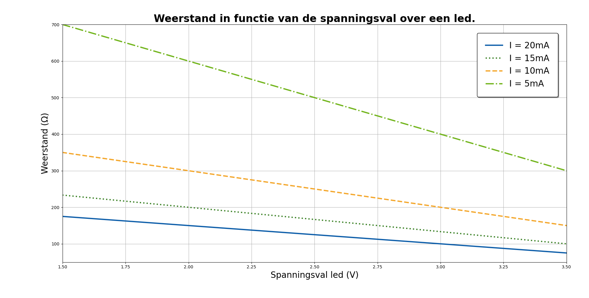

# De wet van Ohm

Nu we weten wat spanning, weerstand en stroom zijn, kunnen we analyseren wat de verhouding is tussen deze drie grootheden. De wet van Ohm beschrijft de verhouding tussen spanning, weerstand en stroom:

\\[\mathrm U = \mathrm R \cdot\mathrm I\\]

De wet zegt dus dat de spanning over een component gelijk is aan de weerstand van die component maal de stroom die door de component loopt. 

Hier is een eenvoudige uitleg:

**Spanning** (\\(\mathrm U\\)) is het elektrische potentiaalverschil, gemeten in volt (\\(\mathrm V\\)), dat aangeeft hoe sterk de elektrische "druk" is in een circuit.

**Stroom** (\\(\mathrm I\\)) is de elektrische stroom, gemeten in ampère (\\(\mathrm A\\)), die aangeeft hoeveel elektronen door een geleider stromen per eenheid van tijd.

**Weerstand** (\\(\mathrm R\\)) is de mate waarin een materiaal de stroom van elektronen hindert, gemeten in ohm (\\(\mathrm \Omega\\)). Hoe hoger de weerstand, hoe moeilijker het is voor de stroom om te vloeien.

De wet van Ohm stelt dat de spanning (\\(\mathrm U\\)) over een component in een elektrisch circuit recht evenredig is met de stroom (\\(\mathrm I\\)) die erdoorheen gaat, en omgekeerd evenredig met de weerstand (\\(\mathrm R\\)) van die component. Met andere woorden, als je de spanning en de weerstand kent, kun je de stroom berekenen, of als je de stroom en de weerstand kent, kun je de spanning berekenen.

Dit eenvoudige principe is essentieel bij het ontwerpen en begrijpen van elektrische circuits en helpt ingenieurs en elektriciens om componenten te selecteren en de prestaties van elektrische systemen te voorspellen.

Hieronder zie je een grafiek die het verband weergeeft tussen de spanning en de stroom voor een gegeven weerstand.

Omdat de µC meestal werkt met voltages van \\(5\\,\mathrm{V}\\), kan het nuttig zijn om de weerstand te plotten in functie van de stroom bij \\(5\\,\mathrm{V}\\). Die grafiek kan je hieronder zien.

Merk op dat de waarden op de x-as maar gaan tot \\(40\\,\mathrm{mA}\\), dit is de maximale stroom die door een pin van de µC mag lopen. 

    <h2 class="title">Voorschakelweerstand bepalen</h2>
    

        Zoals je kan lezen op de componentfiche van led 13, moet je altijd een weerstand in serie schakelen met een led. Dit doe je om de stroom te beperken die door de led gaat. Een led heeft zelf geen weerstand maar veroorzaakt wel een spanningsval. Deze spanningsval hangt af van het kleur en het type van de led. De weerstandswaarde hangt dus af van de spanningsval over de led en de maximale stroom die door de led mag lopen. We kunnen deze weerstandswaarde berekenen met de volgende formule.
        \[\mathrm{R} = \frac{\mathrm{U_{in}} - \mathrm{U_l}}{\mathrm{I_{max}}}\]
        waarbij \(\mathrm{U_{in}} = 5\,\mathrm{V}\), \(\mathrm{I_{max}}\) de maximale stroom is door de led (meestal ongeveer \(20\,\mathrm{mA}\)) en \(\mathrm{U_{l}}\) gelijk is aan de spanningsval over de led. Plotten we deze functie dan kunnen we op de grafiek de weerstandswaarde aflezen voor elke \(\mathrm{U_{l}}\).
        </img>
    

