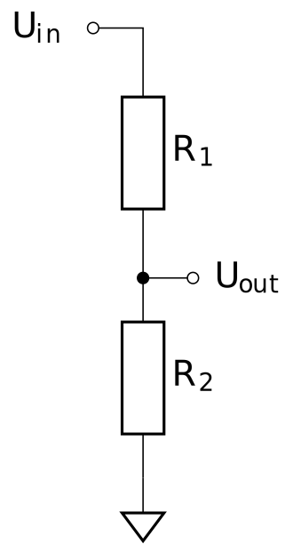

# De spanningsdeler

Een spanningsdeler is een eenvoudige schakeling die in elektronica vaak gebruikt wordt om een voltage te schalen naar een waarde die de µC kan lezen. Hieronder zie je een voorbeeldschema van een spanningsdeler met twee weerstanden.

| Schema |  |
| - | - |
|  | \\(U_{out}\\) is de aansluiting die we verbinden met de µC. De µC zal een 1 lezen als het voltage van \\(U_{out}\\) boven een bepaalde waarde ligt. Deze waarde is afhankelijk van de µC die je gebruikt. Voor de Dwenguino en de Arduino is dit bijvoorbeeld ongeveer 1.3V. Een \\(U_{out}\\) > 1.3V zal dus als een logische 1 gelezen worden, een \\(U_{out}\\) < 1.3V als een logische 0. |

Het voltage op de \\(U_{out}\\) pin hangt af van \\(U_{in}\\), R1 en R2. 

\\[U_{out} = \frac{R_2}{R_1+R_2} U_{in}\\]

In dit schema zijn R1 en R2 constant maar in een schakeling kunnen we R2 vervangen door een sensor die van weerstand verandert op basis van de meetwaarde. Een voorbeeld daarvan is een lichtsensor. De weerstand van de sensor wordt lager als er meer licht op invalt. Vaak wordt voor R1 een variabele weerstand (ofwel potentiometer) gebruikt. Op die manier kan je de verhouding tussen R1 en R2 instellen. Zo kan je instellen vanaf welke sensorwaarde er een detectie zal optreden. Voor onze lichtsensor kunnen we dan instellen vanaf welke lichtsterkte onze µC licht zal detecteren. 

    <h2 class="title">Opdracht</h2>
    

        

            Hieronder zie je de weerstand van een GL55 lichtsensor in functie van de lichtsterkte:
        

        
        

            Welke waarde moet de weerstand R1 hebben om ervoor te zorgen dat de µC een lichtsignaal detecteert vanaf ongeveer 10 Lux?
        

    

