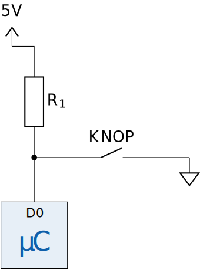

# De pull-up weerstand

Een pull-up weerstand wordt gebruikt om ervoor te zorgen dat een pin van de µC zeker een hoge waarde krijgt zolang die niet actief naar beneden geschakeld wordt. Dit is van belang omdat pinnen van de µC die niet op een gekende spanning zijn aangesloten “**zweven**”. Van die “zwevende” pinnen kunnen we niet voorspellen welke waarde de µC zal detecteren. Als je met je vinger in de buurt van de pin komt, kan het bijvoorbeeld voorkomen dat er ladingen van je vinger overspringen op de pin waardoor die hoog komt te staan.  

| Schema |  |
| - | - |
|  | Deze figuur toont de werking van een pull-up weerstand. De verbinding met 5V via weerstand R1 zorgt ervoor dat, in het geval de de schakelaar niet ingedrukt is, de waarde van de input pin hoog is. Als de knop wordt ingedrukt, verbinden we de pin met de GND dus krijgt die automatisch de waarde 0. |

    <h2 class="title">Inzichtsvraag</h2>
    

        

            Waarom gebruiken we hier een weerstand en verbinden we de pin niet gewoon met de 5V lijn?
        

    

    <h2 class="title">Inzichtsvraag</h2>
    

        

            Er bestaat ook een pull-down weerstand. Deze zorgt ervoor dat de waarde van de pin laag is tot de knop wordt ingedrukt. Kan jij het schema tekenen van een pull-down weerstand?
        

    

<h2 class="title">Interessant om te weten!</h2>
    

        In het schema van de pull-up weerstand zie je een voorbeeld van een <strong>externe</strong> pull-up weerstand. De µC heeft op elke pin ook een <strong>interne</strong> pull-up weerstand. Deze kan je activeren aan de hand van code. Wanneer je werkt met een µC is het dus meestal niet nodig om een externe pull-up weerstand op een pin aan te sluiten.
    

