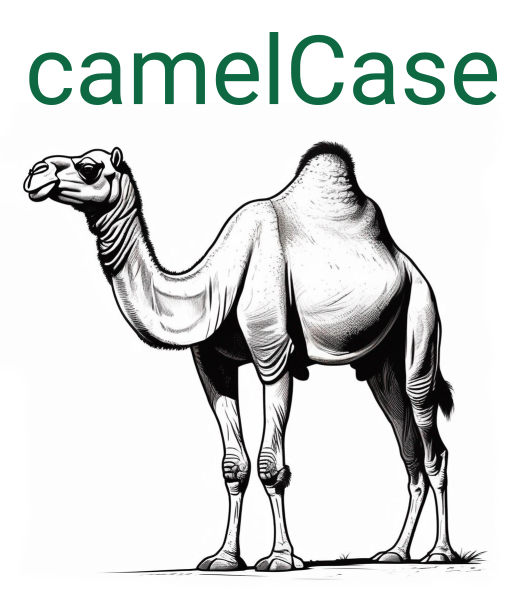

# Variabelen (delcaratie)

Bekijk je de declaratie van dichterbij dan zal je zien dat deze uit twee delen bestaat: 1) Het type van de variabele. 2) De naam van de variabele.

<pre>
    <code class="language-cpp">
        /*          declaratie              toekenning
        <-------------------------------><---------------> 
             type            naam
        <-----------><------------------>*/
        unsigned char digitaleWaardePin6 = digitalRead(6);
    </code>
</pre> 

## Het type van een variabele

Het type van de variabele geeft aan welke soort informatie we erin kunnen opslaan. C++ heeft heel wat ingebouwde types. In onderstaande tabel zie je een overzicht.

<table>
    <tr>
        <th>Code</th>
        <th>Mogelijke waarden</th>
        <th>Aantal bits</th>
        <th>Beschrijving</th>
    </tr>
    <tr>
        <td><code class="language-cpp">char</code></td>
        <td>\(\left[-127, 127\right]\)</td>
        <td>8</td>
        <td>Het <code class="language-cpp">char</code> type is het kleinst moegelijke datatype in C++. Het bevat enkel <strong>gehele getallen</strong> van -127 tot 127. Het komt van het woord character omdat (vroeger) 8 bits gebruikt werd om karakters/letters op te slaan.</td>
    </tr>
    <tr>
        <td><code class="language-cpp">unsigned char</code></td>
        <td>\(\left[0, 255\right]\)</td>
        <td>8</td>
        <td>Het <code class="language-cpp">unsigned char</code> type heeft evenveel bits als een <code class="language-cpp">char</code> maar kan enkel positieve getallen bevatten.</td>
    </tr>
    <tr>
        <td><code class="language-cpp">int</code></td>
        <td>\(\left[-32768, 32768\right]\)</td>
        <td>16</td>
        <td>Het <code class="language-cpp">int</code> type bevat net zoals het <code class="language-cpp">char</code> <strong>gehele getallen</strong>. Het heeft echter een groter bereik.</td>
    </tr>
    <tr>
        <td><code class="language-cpp">unsigned int</code></td>
        <td>\(\left[0, 65535\right]\)</td>
        <td>16</td>
        <td>Het <code class="language-cpp">unsigned int</code> type kan enkel positieve gehele getallen bevatten.</td>
    </tr>
    <tr>
        <td><code class="language-cpp">float</code></td>
        <td>minimum: \(1.2\mathrm{e}^{-38}\), maximum: \(3.4\mathrm{e}^{38}\) (volgens IEEE binary32 standaard)</td>
        <td>32</td>
        <td>Het <code class="language-cpp">float</code> type bevat kommagetallen in "vlottende komma" notatie. Dit is een 32-bit benadering van een kommagetal. Omdat er maar 32 bits beschikbaar zijn kan je niet alle mogelijke kommagetallen erin opslaan. Bijgevolg is de opgeslagen waarde een benadering van de effectieve waarde.</td>
    </tr>
</table>

Er bestaan nog heel wat andere datatypes in C++, met die zal je later waarschijnlijk nog in contact komen.

    <h2 class="title">Kies het juiste type!</h2>
    

        De µC heeft maar een beperkte rekenkracht. Om die zo optimaal te benutten, kies je dus best altijd voor het kleinst mogelijke datatype. Het <code class="language-cpp">char</code> type krijgt voorrang op het <code class="language-cpp">int</code> type die dan weer voorrang krijgt op het <code class="language-cpp">float</code> type. Met andere woorden, als de data die je wil opslaan binnen een kleiner datatype past, sla het dan op in een variabele met dat kleinere datatype.
    

## De naam van de variabele

De naam van een variabele mag je vrij kiezen. Deze mag letters, cijfers en lage streepjes (_) bevatten. Buiten deze beperking, legt C++ geen andere regels op waaraan variabelen moeten voldoen. Er zijn echter twee belangrijke **conventies** die je <strong>moet</strong> volgen om duidelijke en leesbare code te schrijven. 

### 1. Kies een duidelijke naam

Zoals we al meerdere keren hebben aangegeven, is de leersbaarheid van je code zeer belangrijk. Een belangrijke voorwaarde voor leesbare code is dat je duidelijke variabelenamen kiest. Zorg dat de naam van de variabele duidelijk beschrijft wat de inhoud ervan is. Volg daarvoor de volgende regels:

<ul>
    <li>Kies een naam gelinkt aan de probleemcontext.</li>
    <li>Gebruik geen enkelvoudige letters als naam.</li>
    <li>Probeer afkortingen te vermijden, schrijf woorden voluit.</li>
    <li>Probeer ervoor te zorgen dat namen van variabelen niet eindeloos lang worden.</li>
</ul>

Als je bijvoorbeeld een rijdende robot bouwt die een sensor heeft waarmee deze de afstand tot de muur meet. Kies voor de gemeten afstand bijvoorbeeld de naam <code class="language-cpp">afstandTotMuur</code> en <strong>NIET</strong> <code class="language-cpp">afstand</code>, <code class="language-cpp">deGemetenAfstandVanDeRobotTotDeMuurDieVoorDeRobotStaat</code> of nog onduidelijker <code class="language-cpp">a</code>.

### 2. Gebruik overal dezelfde stijl

<table>
    <tr>
        <td>
            Er zijn verschillende stijlen waarin je de namen van je variabelen kan schrijven. De stijl die meestal gebruikt wordt in C++, en ook in de voorbeelden in deze leerlijn, is <strong>camelCase</strong>. Bij <strong>camelCase</strong> begint het eerste woord in de variabele met een kleine letter. Elk volgend woord begint met een hoofdletter. Bijvoorbeeld:
            <ul>
                <li><code class="language-cpp">analogeWaardePin</code></li>
                <li><code class="language-cpp">afstand</code></li>
                <li><code class="language-cpp">waardeKnop</code></li>
            </ul>
        </td>
        <td></img></td>
    </tr>

</table>

    <h2 class="title">Wist je dat!</h2>
    

        Er bestaan nog heel wat andere stijlen voor variabelen. 
        <ul>
            <li><code class="language-cpp">snake_case</code>: waarbij tussen elk woord een laag streepje komt.</li>
            <li><code class="language-cpp">PascalCase</code>: gelijkaardig aan camelCase maar begint ook altijd met een hoofdletter.</li>
            <li><code class="language-css">kebab-case</code>: waarbij er tussen elk woord een gewoon streepje komt. De naam komt van de satéstok die door blokjes vlees en groenten zit. Merk op dat deze stijl niet mogelijk is in C++ omdat je geen streepjes kan gebruiken in namen van variabelen.</li>
        </ul>
    

