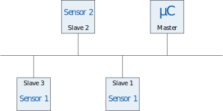

 # Definitie

 Bus communicatie verloopt tussen complexere digitale componenten. Dit kan zijn tussen twee microcontroller maar ook tussen een microcontroller en een geavanceerde sensor. Om te kunnen communiceren zijn deze componenten meestal verbonden met een of meerdere draden. Eigen aan een bus protocol is dat er **meer dan twee** apparaten met die draden verbonden kunnen zijn. Op onderstaande afbeelding zie je een voorbeeld van vier apparaten die verbonden zijn met een bus (= een of meerdere draden). In dit geval is dat een microcontroller en drie sensoren.

  

 Je ziet in de afbeelding ook dat apparaten op de bus ofwel een *master* ofwel een *slave* zijn. Er is maar één apparaat op de bus dat de *master* kan zijn. Deze is verantwoordelijk voor de coördinatie van van de bus. De master zorgt er dus voor dat apparaten niet tegelijk data sturen op de bus. Anders zou er een conflict ontstaan. De slave luistert op de bus en zal enkel antwoorden op berichten die specifiek aan die slave geadresseerd zijn.
 