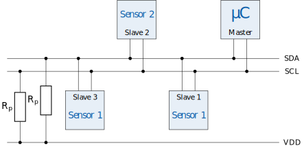

# I²C

I²C (*I kwadraat C*) staat voor *inter-integrated circuit* en is dus ontworpen voor communicatie tussen geïntegreerde schakelingen (bv. microcontrollers). De standaard werd in 1982 ontwikkeld door Philips (nu NXP Semiconductors) en wordt nog steeds heel vaak gebruikt. 

I²C maakt gebruik van twee draden voor de communicatie <code class="lang-cpp">SDA</code> en <code class="lang-cpp">SCL</code>. <code class="lang-cpp">SDA</code> staat voor seriële data en <code class="lang-cpp">SCL</code> voor seriële klok. Het I²C protocol verwacht dat de spanning op deze lijnen standaard hoog is (5V). Daarom worden de <code class="lang-cpp">SDA</code> en <code class="lang-cpp">SCL</code> hoog getrokken via een pull-up weerstand. Op onderstaande afbeelding zie je hoe verschillende apparaten op een I²C bus aangesloten kunnen worden.

