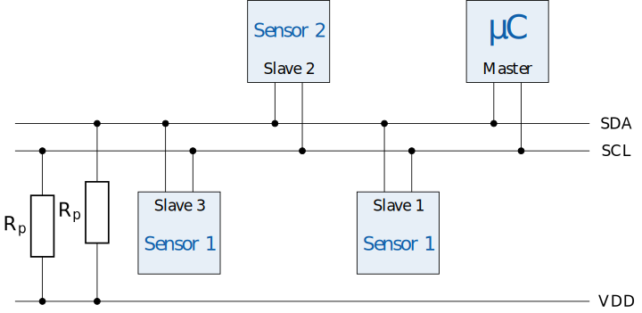

# I²C

I²C (*I kwadraat C*) staat voor *inter-integrated circuit* en is dus ontworpen voor communicatie tussen geïntegreerde schakelingen (bv. microcontrollers). De standaard werd in 1982 ontwikkeld door Philips (nu NXP Semiconductors) en wordt nog steeds heel vaak gebruikt. 

## Bedrading

I²C maakt gebruik van twee draden voor de communicatie, deze krijgen de namen <code class="lang-cpp">SDA</code> en <code class="lang-cpp">SCL</code>. <code class="lang-cpp">SDA</code> staat voor seriële data en <code class="lang-cpp">SCL</code> voor seriële klok. Het I²C protocol verwacht dat de spanning op deze lijnen standaard hoog is (5V). Daarom worden de <code class="lang-cpp">SDA</code> en <code class="lang-cpp">SCL</code> hoog getrokken via een pull-up weerstand. De waarde van deze weerstand is minimaal \\(1.6\mathrm{K \Omega}\\). De maximale waarde die je voor de pull-up weerstand kan gebruiken hangt af van de capaciteitswaarde van de bus. Hoe hoger deze capaciteitswaarde, hoe lager de waarde van de pull-up weerstand moet zijn. Je wil eigenlijk een zo hoog mogelijke waarde voor de pull-up weerstand met de voorwaarde dat deze laag genoeg is om het systeem te doen werken. Een hogere waarde voor de pull-up weerstand zorgt er immers voor dat er minder stroomverbruik zal zijn. Voor eenvoudige schakelingen, met korte draden en weinig apparaten op de bus, kan je de interne pull-up weerstanden van de microcontroller gebruiken. De waarde van de interne pull-up weerstand ligt tussen de \\(20\mathrm{K \Omega}\\) en \\(50\mathrm{K \Omega}\\). 

Op onderstaande afbeelding zie je hoe verschillende apparaten op een I²C bus aangesloten kunnen worden.

Op de Dwenguino zijn standaard twee pinnnen voorzien met de nodige logica om gegevens te sturen via I²C. Pin <code class="lang-cpp">15</code> moet je verbinden met de <code class="lang-cpp">SDA</code> lijn. Pin <code class="lang-cpp">14</code> met de <code class="lang-cpp">SCL</code> lijn.

## Werking

Het apparaat dat de controle heeft over de bus (de master), is deze verantwoordelijk om de communicatie met een van de randapparaten (slaves) te starten. 

<table>
    <tr>
        <th>Master</th>
        <td>START</td>
        <td>ADRES + SCHRIJF_BIT</td>
        <td></td>
        <td>REGISTER_ADRES</td>
        <td></td>
        <td>DATA</td>
        <td></td>
        <td>STOP</td>
    </tr>
    <tr>
        <th>Slave</th>
        <td></td>
        <td></td>
        <td>ACKNOWLEDGE</td>
        <td></td>
        <td>ACKNOWLEDGE</td>
        <td></td>
        <td>ACKNOWLEDGE</td>
        <td></td>
    </tr>
</table>

## Hoe programmeren

