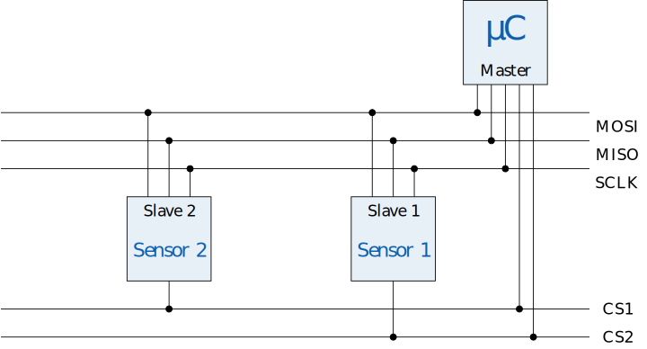
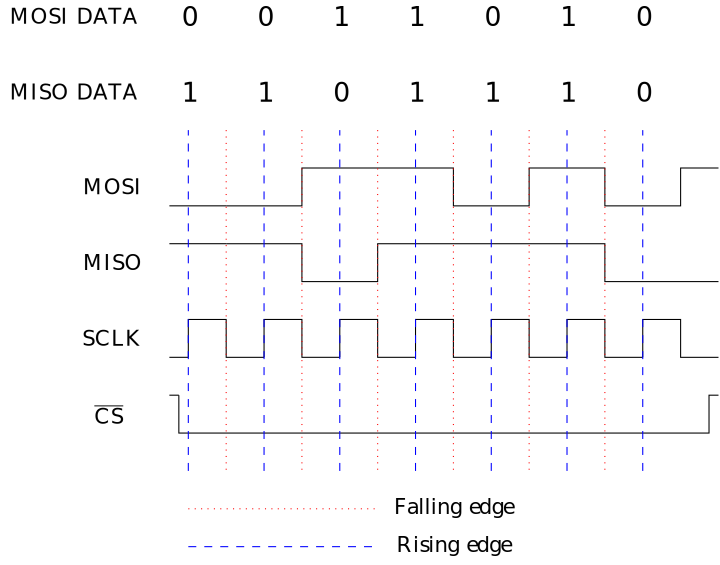

# SPI

SPI staat voor *serial peripheral interface* en legt een methode vast waarop geïntegreerde schakelingen met elkaar kunnen communiceren. De standaard werd in 1980 ontwikkeld door Motorola. 

## Bedrading

SPI maakt gebruik van minimaal vier draden om informatie uit te wisselen tussen systemen. Deze draden krijgen de volgende namen:

<table>
<tr>
<th>Afkorting</th>
<th>Naam</th>
<th>Beschrijving</th>
</tr>
<tr>
<td><code class="lang-cpp" style="text-decoration:overline">CS</code></td>
<td>Chip Select</td>
<td>Vanop de master vertrekt er een <code class="lang-cpp" style="text-decoration:overline">CS</code> draad naar elke slave. De master zal het signaal op de draad van de slave waarmee deze wil communiceren naar 0V brengen. Zo weet de slave dat die moet luisteren op de bus.</td>
</tr>
<tr>
<td><code class="lang-cpp">SCLK</code></td>
<td>Serial Clock</td>
<td>De master zal op de <code class="lang-cpp">SCLK</code> lijn een blokgolf sturen. Elke keer dat deze blokgolf van een lage waarde naar een hoge waarde gaat (rising edge in mode 0) zullen de master en slave de waarde op respectivelijk de <code class="lang-cpp">MISO</code> en <code class="lang-cpp">MOSI</code> lijnen inlezen.</td>
</tr>
<tr>
<td><code class="lang-cpp">MOSI</code></td>
<td>Master Out, Slave In</td>
<td>Op deze draad wordt de data gezet die <strong>van de master naar de slave gaat</strong>.</td>
</tr>
<tr>
<td><code class="lang-cpp">MISO</code></td>
<td>Master In, Slave Out</td>
<td>Op deze draad wordt de data gezet die <strong>van de slave naar de master gaat</strong>.</td>
</tr>
</table>

Wanneer er maar één master en één slave met elkaar communiceren, zijn er vier draden nodig. Voor elke extra slave op de bus komt er echter een <code class="lang-cpp" style="text-decoration:overline">CS</code> lijn bij. Dit is een van de nadelen van SPI. Het voordeel van SPI is dan weer dat we op hetzelfde moment in twee richtingen data kunnen sturen via de <code class="lang-cpp">MOSI</code> en <code class="lang-cpp">MISO</code> lijnen. Bijgevolg spreken we hier van een **full-duplex** protocol.

Op onderstaande afbeelding kan je zien hoe je apparaten via een SPI bus kan verbinden.

Op de Dwenguino kan je de <code class="lang-cpp">MOSI</code> lijn aansluiten op pin <code class="lang-cpp">2</code> van de uitbreidingsconnector, de <code class="lang-cpp">MISO</code> lijn op pin <code class="lang-cpp">12</code> van de uitbreidingsconnector en <code class="lang-cpp">SCLK</code> op pin <code class="lang-cpp">13</code> van de uitbreidingsconnector. De <code class="lang-cpp" style="text-decoration:overline">CS</code> lijnen kan je met gelijk welke digitale pin verbinden. Je zal in je programma dan de juiste slave moeten activeren door de overeenkomstige <code class="lang-cpp" style="text-decoration:overline">CS</code> pin laag te brengen.

## Werking

Op de onderstaande figuur zie je een voorbeeld van een timing diagram van de communicatie. Hier worden 7 bits verstuurd. Met is SPI is het mogelijk om **full-duplex** te communiceren. Dat wil zeggen dat er zowel data van de master naar de slave kan gaan als omgekeerd. SPI heeft verschillende modi, deze bepalen onder andere of de data ingelezen wordt op een rising- of falling-edge van de klok. In dit voorbeeld zien we dat de data gelezen wordt op de rising-edge. Op de falling edge wordt de volgende bit op een van de datalijnen gezet.

## Hoe programmeren

Om te communiceren via SPI, kan je gebruik maken van de SPI bibliotheek. 