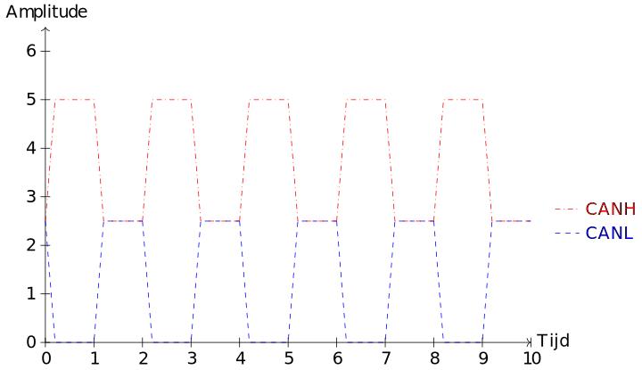

# CAN bus

CAN staat voor *Controlled area network* en werd in 1986 uitgebracht door het duitse bedrijf Bosch. CAN werd specifiek ontworpen voor de communicatie tussen geïntegreerde schakelingen in auto's. CAN bus is een zeer betrouwbaar protocol omdat het moet voldoen aan heel wat veiligheidsvoorschriften. 

## Bedrading

De CAN bus maakt net als I²C gebruik van twee draden voor de communicatie. De draden krijgen in CAN de namen <code class="lang-cpp">CANH</code> (CAN high) en <code class="lang-cpp">CANL</code> (CAN low). Alle apparaten zijn zowel met <code class="lang-cpp">CANH</code> als <code class="lang-cpp">CANL</code> verbonden.  Hieronder zie je een voorbeeld van vier apparaten die aangesloten zijn op een CAN bus. De lijnen worden op het einde aan elkaar gekoppeld met een weerstand om refelecties in het signaal te vermijden.

## Werking

CAN maakt, net als I²C gebruik van twee draden voor de communicatie. Maar in tegenstelling tot I²C is can een **multi-master** protocol. Alle apparaten op de bus kunnen dus het initiatief nemen om te sturen. Dit kan ervoor zorgen dat er botsingen zijn op de bus wanneer twee apparaten tegelijk gegevens willen sturen. Om deze botsingen op te lossen, krijgen apparaten een ID nummer. Apparaten met een lager ID nummer, krijgen voorang op apparaten met een hoger ID nummer.

Om gegevens te sturen worden zowel de <code class="lang-cpp">CANH</code> en <code class="lang-cpp">CANL</code> draden gebruikt. Het is dus niet mogelijk om op hetzelfde moment in twee richtingen te sturen. Het gaat hier dus over een **half-duplex** protocol. 

Omdat het bij CAN belangrijk is dat signalen correct ontvangen kunnen worden, zijn er in het CAN protocol specifieke mechanismen ingebouwd om het protocol betrouwbaarder te maken. Zo maakt CAN gebruik van differentiële signalen en wordt er aan de gegevens een cyclic redundancy check (CRC) toegevoegd. 

### Differentiële signalen.

In zowel I²C als SPI worden de bits die verstuurd moeten worden op de bus omgezet naar spanningen van 5V of 0V. 5V komt overeen met bitwaarde 1, 0V met bitwaarde 0. In een wagen wordt de CAN bus echter gevoelig voor ruis. De verschillende componenten in de wagen, zoals vibraties van de motor of magnetische velden opgewekt door de speakers. Deze ruis kan ervoor zorgen dat het voltage op de bus afwijkt van de verstuurde waarde. Hierdoor kunnen fouten optreden in de communicatie. Hieronder zie je een voorbeeld van een perfecte blokgolf zonder ruis.

Merk op dat zo'n signaal in de praktijk nooit voorkomt. Er zal altijd wat ruis zitten op het signaal. Daarom zal de microcontroller niet kijken of het signaal exact 5V of 0V is maar zal een waarde boven de 2.5V gelezen worden als een 1 en een waarde onder 2.5V als een 0. Wanneer er nu echter veel ruis zit op het signaal, is het mogelijk dat er een verkeerde waarde gelezen wordt. Dat kan je zien op onderstaande afbeelding.

In het CAN protocol wordt een minder ruisgevoelig systeem toegepast om bits om te zetten naar voltages. Dat systeem werkt met differentiële signalen. Daarvoor plaatst de CAN controller een tegenovergesteld signaal op <code class="lang-cpp">CANH</code> en <code class="lang-cpp">CANL</code>. Hieronder zie je een voorbeeld van zo'n signaal. 

Het eigenlijke signaal bekom je door het signaal op <code class="lang-cpp">CANL</code> af te trekken van <code class="lang-cpp">CANH</code>.

Door de twee signalen van elkaar af te trekken, kan je ruis op de lijn uit het signaal verwijderen. Meestal zal de ruis op de <code class="lang-cpp">CANH</code> en <code class="lang-cpp">CANL</code> lijnen gelijkaardig zijn omdat deze draden vlak naast elkaar liggen. Door het signaal op de twee lijnen van elkaar af te trekken, trek je ook de ruis van zichzelf af. Hieronder zie je daar een voorbeeld van:

