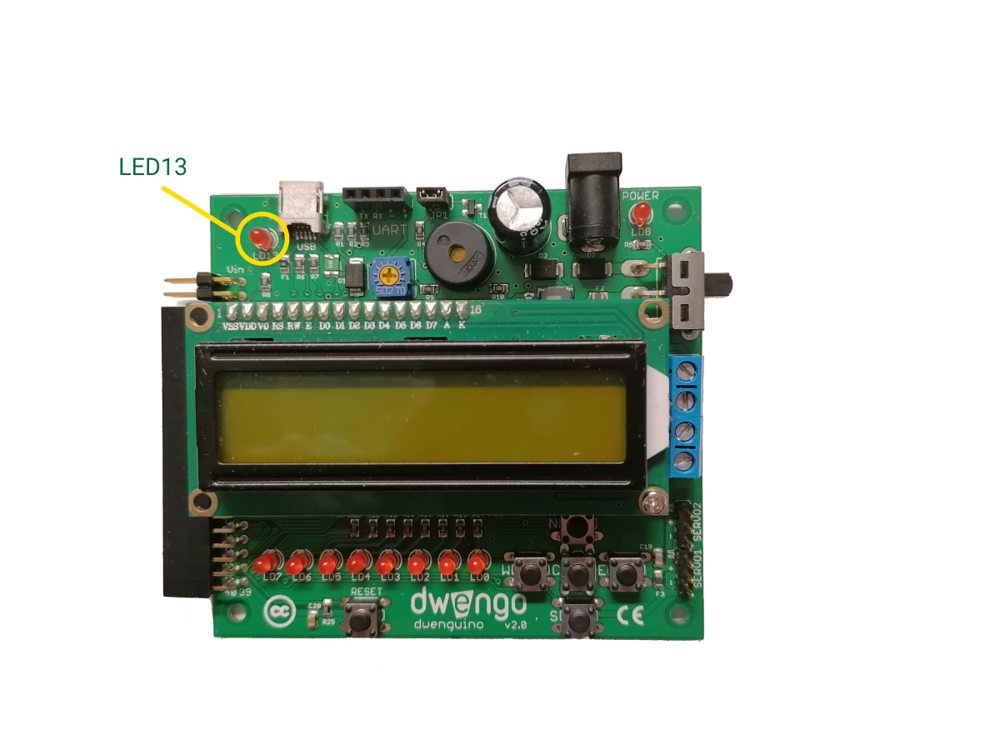

    <h1 class="title">LED13</h1>
    <h2 class="subtitle">Het lampje waarmee je alles kan testen.</h2>
    

        <h3 class="info_item_title">In het echt</h3>
        

            </img>
        

    

    

        <h3 class="info_item_title">In het echt</h3>
        

            TODO: add image.
        

    

