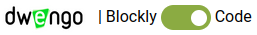
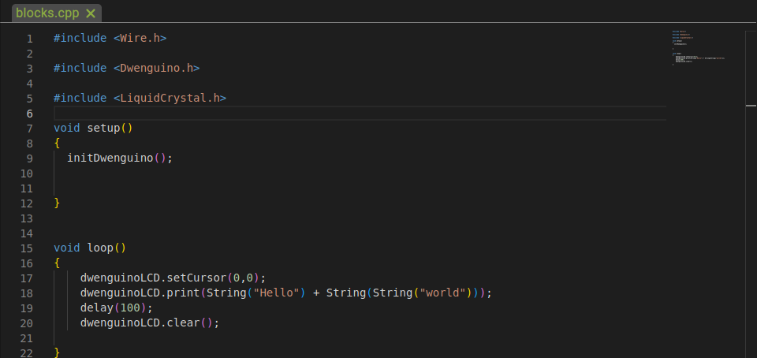
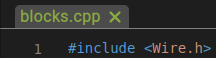

    <h1 class="title">WIP - Tekstuele editor</h1>
    <h2 class="subtitle">Hoe werk ik met de tekstuele editor?</h2>
    

        

            <h3 class="info_item_title">1. Van grafisch naar tekstueel</h3>
            

                Om te navigeren van de grafische naar de tekstuele programmeeromgeving, klik je op linksboven op de knop.
            

            

                </img>
            

        

        

            <h3 class="info_item_title">2. Code</h3>
            

                Wanneer je op de knop drukt, kom je terecht in de tekstuele programmeeromgeving, waar je reeds een stuk code ziet staan. Dit is de achterliggende code voor het programma dat in de grafische programmeeromgeving stond.
            

            

                </img>
            
        
            

                Merk ook op dat er bovenaan een tabblad staat genaamd <em>blocks.cpp</em>. 
            

            

                </img>
            

            
      
                Voor elke keer dat je van de grafische naar de tekstuele programmeeromgeving gaat of een ander programma inlaadt, komt er hier een nieuw tabblad bij.
            
                
        

        

            <h3 class="info_item_title">3. Code opslaan</h3>
            

                Vooraleer je de code op gaat slaan, geef je het bestand best eerst een naam. Dit kan je doen door te dubbelklikken op de tab. Vervolgens sla je op via de sneltoest <em>ctrl + s</em> of door op het opslaan-icoon rechtsboven te klikken:
            

            

                </img>
            
        
        

        

            <h3 class="info_item_title">4. Code openen</h3>
            

                Om in het begin van een sessie je code terug te openen, druk je op het openen-icoon rechtsboven en zoek je het gewenste bestand:
            

            

                </img>
            
              
        

    

