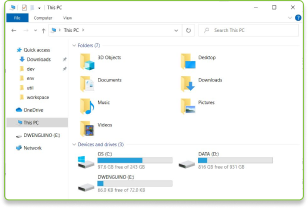
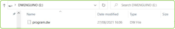

    <h1 class="title">Code uploaden</h1>
    <h2 class="subtitle">Hoe zet ik code vanop mijn computer over naar de Dwenguino?</h2>
    

        

            <h3 class="info_item_title">Alle stappen visueel</h3>
            

                

                    <iframe allowfullscreen="" src="https://www.youtube.com/embed/VpAXLlT_JP0" height="315px" width="420px"></iframe>
                

            

        

        

            <h3 class="info_item_title">1. De binaire code downloaden</h3>
            

                Download het programma uit de simulator met de knop uit het hoofdmenu: </img>. Het programma komt automatisch in de ‘Downloads’-map met bestandsnaam “program.dw”. Het dw-bestand bevat de binaire code van je programma. Het is de vertaling van je programma naar een taal die de Dwenguino begrijpt.
            

        

        

            <h3 class="info_item_title">2. USB kabel aansluiten</h3>
            

                Verbind de computer met de Dwenguino door middel van de meegeleverde USB-kabel.
            

        

        

            <h3 class="info_item_title">3. Zet Dwenguino in programmeermodus</h3>
            

                Druk de ‘zuid’-knop van de Dwenguino in en houd de knop ingedrukt.  
                Druk vervolgens de ‘reset’-knop van de Dwenguino in.  
                Los dan eerst de ‘reset’-knop.  
                Los daarna de ‘zuid’-knop. Op het lcd-scherm verschijnt de boodschap “Zet bestand over”. 
            

        

        

            <h3 class="info_item_title">4. Bestand overzetten</h3>
            

                De Dwenguino is nu beschikbaar in de verkenner van Windows, zoals je een USB-stick zou openen. Wanneer je de ‘Dwenguino’-map opent, kan je het programma “program.dw” uit de ‘Downloads’-map erin slepen.
            

            

                </img>
            

            

                </img>
            

        

        

            <h3 class="info_item_title">5. De code laten uitvoeren</h3>
            

                Druk nog een laatste keer op de ‘reset’-knop van de Dwenguino om het programma definitief over te zetten en de Dwenguino te ontkoppelen. Je programma staat nu in het geheugen van de Dwenguino en zal onmiddellijk worden uitgevoerd.
            

            

                Wil je het programma op de Dwenguino opnieuw starten? Gebruik dan de ‘reset’-knop op de Dwenguino.
            

        

    

