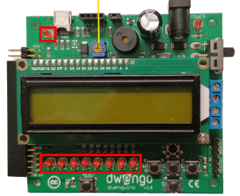

    <h1 class="title">Led</h1>
    <h2 class="subtitle">Leds laten branden</h2>
    

        

            <h3 class="info_item_title">In het echt</h3>
            

                </img>
            

        

        

            <h3 class="info_item_title">Type</h3>
            

                Uitvoer, digitale actuator 
            

        

        

            <h3 class="info_item_title">Pinnen</h3>
            

                N.v.t.
            

        

        

            <h3 class="info_item_title">Werking</h3>
            

               Op een arduino-bord vind je meestal een led terug. 
                
               Hieronder vind je een simpel voorbeeld om deze led te laten branden.
            

        

        

            <h3 class="example_item_title">Voorbeeld: led laten branden.</h3>
            

<pre>
<code class="language-arduino">
    
void setup() {
  // put your setup code here, to run once:
    pinMode(LED_BUILTIN, OUTPUT);
}

void loop() {
  // put your main code here, to run repeatedly:
    digitalWrite(LED_BUILTIN, HIGH);  // turn the LED on (HIGH is the voltage level)
    delay(1000);                      // wait for a second
    digitalWrite(LED_BUILTIN, LOW);   // turn the LED off by making the voltage LOW
    delay(1000);                      // wait for a second
}

</code>
</pre> 
            

        

    

