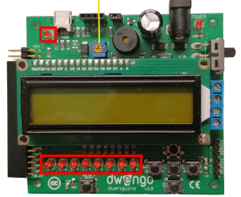

    <h1 class="title">Led</h1>
    <h2 class="subtitle">Leds laten branden</h2>
    

        

            <h3 class="info_item_title">In het echt</h3>
            

                </img>
            

        

        

            <h3 class="info_item_title">Type</h3>
            

                Uitvoer, digitale actuator 
            

        

        

            <h3 class="info_item_title">Pinnen</h3>
            

                N.v.t.
            

        

        

            <h3 class="info_item_title">Werking</h3>
            

               Links onderaan op het dwenguino-bord vind je acht leds. 
                
               Deze leds zijn <strong>led 0</strong>, <strong>led 1</strong>, ..., <strong>led 7</strong>, van rechts naar links. De eerste led is dus <strong>led 0</strong>. In computerwetenschappen is het vaak de conventie om te beginnen tellen vanaf 0. Dit heb je misschien ook al gemerkt bij het lcd-scherm. 
                
               Links bovenaan is er nog een extra led: <strong>led 13</strong>. Dit laatste led heeft enkele speciale functionaliteiten en krijgt daarom een aparte fiche.
            

        

        

            <h3 class="example_item_title">Voorbeeld: led 0 laten branden.</h3>
            

<pre>
<code class="language-arduino">
    
#include <Wire.h>
#include <Dwenguino.h>
#include <LiquidCrystal.h>

void setup()
{
  initDwenguino();
}

void loop()
{
    pinMode(32, OUTPUT);
    digitalWrite(32, HIGH);
}
</code>
</pre> 
            

        

    

