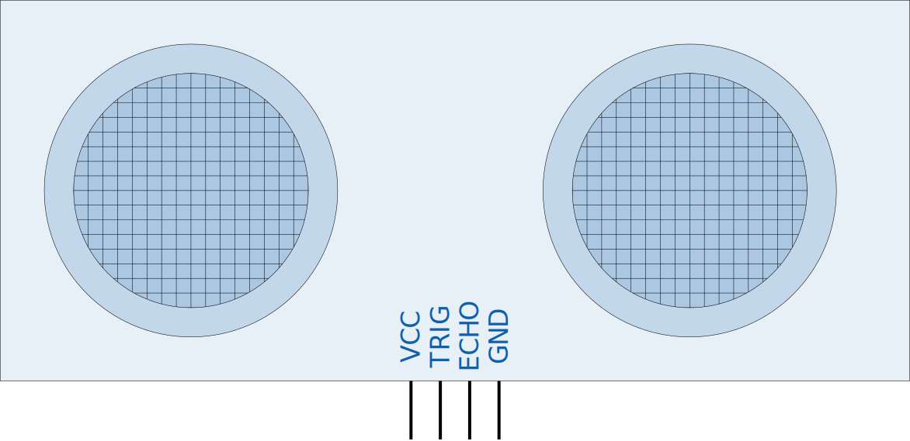

    <h1 class="title">WIP - Led</h1>
    <h2 class="subtitle">Leds laten branden</h2>
    

        

            <h3 class="info_item_title">In het echt</h3>
            

                </img>
            

        

        

            <h3 class="info_item_title">Type</h3>
            

                Uitvoer, digitale actuator 
            

        

        

            <h3 class="info_item_title">Pinnen</h3>
            

                <table>
                    <tr><td>VCC</td><td>De 5 V-voeding, soms ook aangeduid met een +.</td></tr>
                    <tr><td>GND</td><td>De referentiespanning of de grond, soms ook aangeduid met een -.</td></tr>
                    <tr><td>PIN</td><td>...</td></tr>
                    <tr><td>PIN</td><td>...</td></tr>
                    <tr><td>PIN</td><td>...</td></tr>
                </table>
            

        

        

            <h3 class="info_item_title">Werking</h3>
            

               Links onderaan op het dwenguino-bord vind je acht leds. 
                
               Deze leds zijn *led 0*, *led 1*, ..., *led 7*, van rechts naar links. De eerste led is dus *led 0*. In computerwetenschappen is het vaak de conventie om te beginnen tellen vanaf 0. Dit heb je misschien ook al gemerkt bij het lcd-scherm. 
                
               Links bovenaan is er nog een extra led: *led 13*. Dit laatste led heeft enkele speciale functionaliteiten en krijgt daarom een aparte fiche.
            

        

        

            <h3 class="info_item_title">Symbool</h3>
            

                
            

        

        

            <h3 class="info_item_title">Aansluiting</h3>
            

                
            

        

        

            <h3 class="example_item_title">Voorbeeld: led 0 laten branden.</h3>
            

<pre>
<code class="language-arduino">
    
    #include <Wire.h>  
    #include <Dwenguino.h>
    #include <LiquidCrystal.h>

    void setup(){
        initDwenguino();

        dwenguinoLCD.setCursor(0,0);
        dwenguinoLCD.print(String("Welkom robot"));
    }

    void loop(){

    }
</code>
</pre> 
            

        

    

