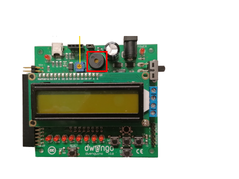

 

    <h1 class="title">Zoemer</h1>
    <h2 class="subtitle">Tonen afspelen</h2>
    

        

            <h3 class="info_item_title">In het echt</h3>
            

                </img>
            

        

        

            <h3 class="info_item_title">Type</h3>
            

                Uitvoer, digitale actuator 
            

        

        

            <h3 class="info_item_title">Pinnen</h3>
            

                N.v.t.
            

        

        

            <h3 class="info_item_title">Werking</h3>
            

                Met een zoemer of buzzer kan je geluiden afspelen.  
                 
                Geluid is een golf van luchtdruk veroorzaakt door een trillend object zoals bijvoorbeeld een instrument of luidspreker. De hoeveelheid trillingen per seconde (de frequentie) bepaalt de toonhoogte. Wanneer het aantal trillingen per seconde tussen de 20 en 20 000 ligt, dan kan je dit als mens horen. Voor trillingen per seconde gebruiken we de eenheid Hertz, afgekort Hz. De mens kan dus trillingen horen tussen de 20 Hz en 20 000 Hz. 
                 
            

        

        

            <h3 class="example_item_title">Voorbeeld: een zoemer een toon herhaaldelijk laten afspelen.</h3>
            

<pre>
<code class="language-arduino">

const int buzzer = 9; //buzzer to arduino pin 9

void setup(){
  pinMode(buzzer, OUTPUT); // Set buzzer - pin 9 as an output
}

void loop(){
  tone(buzzer, 1000); // Send 1KHz sound signal...
  delay(1000);        // ...for 1 sec
  noTone(buzzer);     // Stop sound...
  delay(1000);        // ...for 1sec
}

</code>
</pre> 
            

        

    

