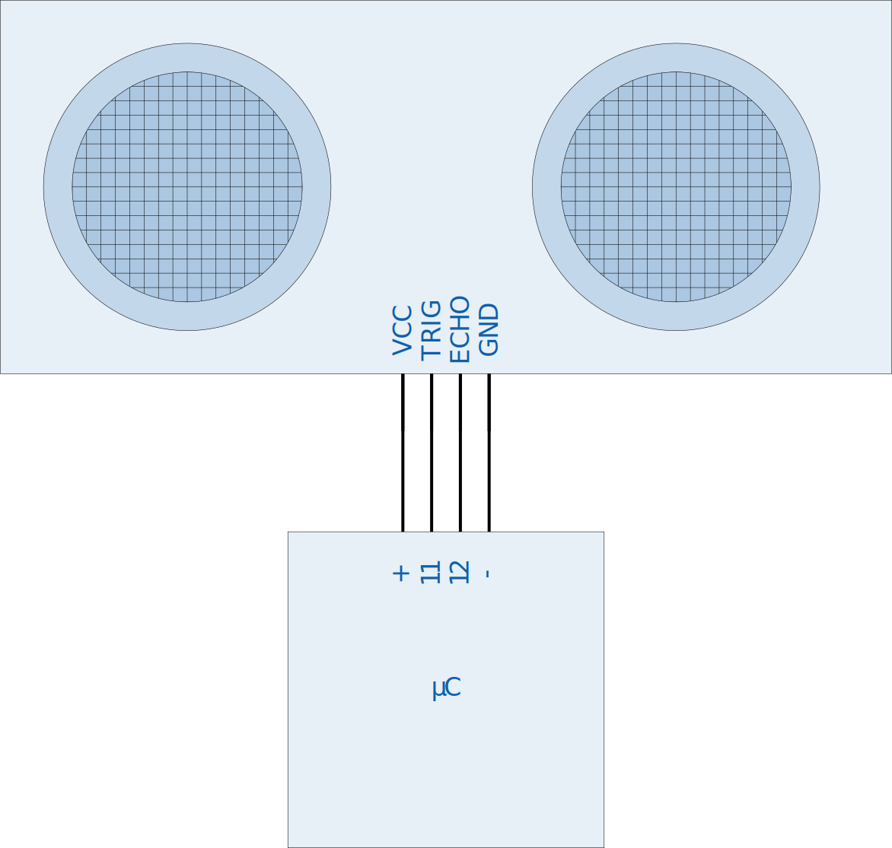

 

    <h1 class="title">WIP - Zoemer</h1>
    <h2 class="subtitle">Tonen afspelen</h2>
    

        

            <h3 class="info_item_title">In het echt</h3>
            

                </img>
            

        

        

            <h3 class="info_item_title">Type</h3>
            

                Uitvoer, digitale actuator 
            

        

        

            <h3 class="info_item_title">Pinnen</h3>
            

                <table>
                    <tr><td>VCC</td><td>De 5 V-voeding, soms ook aangeduid met een +.</td></tr>
                    <tr><td>GND</td><td>De referentiespanning of de grond, soms ook aangeduid met een -.</td></tr>
                    <tr><td>PIN</td><td>...</td></tr>
                    <tr><td>PIN</td><td>...</td></tr>
                    <tr><td>PIN</td><td>...</td></tr>
                </table>
            

        

        

            <h3 class="info_item_title">Werking</h3>
            

                Boven het lcd-scherm kan je een een ronde, zwarte component zien. Dit is de zoemer of buzzer. Hiermee kan je geluiden afspelen.  
                 
                Geluid is een golf van luchtdruk veroorzaakt door een trillend object zoals bijvoorbeeld een instrument of luidspreker. De hoeveelheid trillingen per seconde (de frequentie) bepaalt de toonhoogte. Wanneer het aantal trillingen per seconde tussen de 20 en 20 000 ligt, dan kan je dit als mens horen. Voor trillingen per seconde gebruiken we de eenheid Hertz, afgekort Hz. De mens kan dus trillingen horen tussen de 20 Hz en 20 000 Hz. 
                 
                Om geluid te kunnen afspelen is de dwenguino voorzien van een eenvoudige buzzer die je een gekozen frequentie kunt laten afspelen.
            

        

        

            <h3 class="info_item_title">Symbool</h3>
            

                
            

        

        

            <h3 class="info_item_title">Aansluiting</h3>
            

                
            

        

        

            <h3 class="example_item_title">Voorbeeld: de zoemer een toon herhaaldelijk laten afspelen.</h3>
            

<pre>
<code class="language-arduino">

    #include <Wire.h>
    #include <Dwenguino.h>
    #include <LiquidCrystal.h>

    void setup(){
        initDwenguino();
    }

    void loop(){
        pinMode(32, OUTPUT);
        digitalWrite(32, HIGH);
    }
</code>
</pre> 
            

        

    

