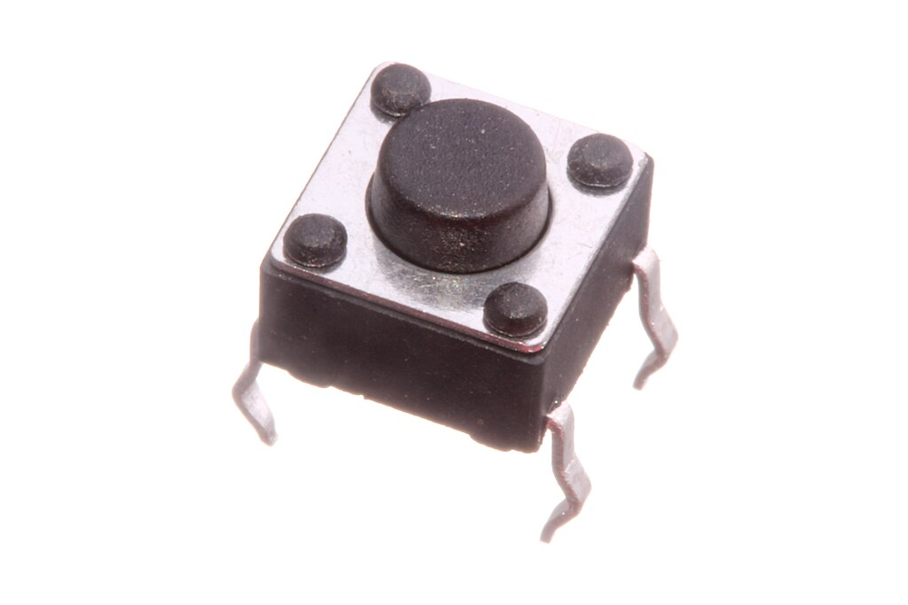

    <h1 class="title">Knoppen</h1>
    <h2 class="subtitle">Programma's starten m.b.v. knoppen</h2>
    

        

            <h3 class="info_item_title">In het echt</h3>
            

                </img>
            

        

        

            <h3 class="info_item_title">Type</h3>
            

                Invoer 
            

        

        

            <h3 class="info_item_title">Pinnen</h3>
            

                N.v.t.
            

        

        

            <h3 class="info_item_title">Werking</h3>
            

                Je kan deze bijvoorbeeld gebruiken om bepaalde delen van je programma niet te laten uitvoeren tot je dit expliciet aangeeft door een knop in te drukken.
            

        

        

            <h3 class="example_item_title">Voorbeeld: led gaat pas branden wanneer je een knop indrukt.</h3>
            

<pre>
<code class="language-cpp">
    
// constants won't change. They're used here to set pin numbers:
const int buttonPin = 2;  // the number of the pushbutton pin
const int ledPin = 13;    // the number of the LED pin

// variables will change:
int buttonState = 0;  // variable for reading the pushbutton status

void setup() {
  // initialize the LED pin as an output:
  pinMode(ledPin, OUTPUT);
  // initialize the pushbutton pin as an input:
  pinMode(buttonPin, INPUT);
}

void loop() {
  // read the state of the pushbutton value:
  buttonState = digitalRead(buttonPin);

  // check if the pushbutton is pressed. If it is, the buttonState is HIGH:
  if (buttonState == HIGH) {
    // turn LED on:
    digitalWrite(ledPin, HIGH);
  } else {
    // turn LED off:
    digitalWrite(ledPin, LOW);
  }
}
</code>
</pre> 
            

        

    

