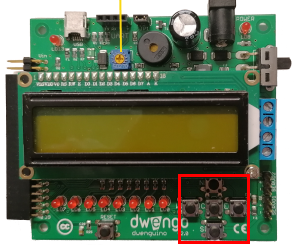
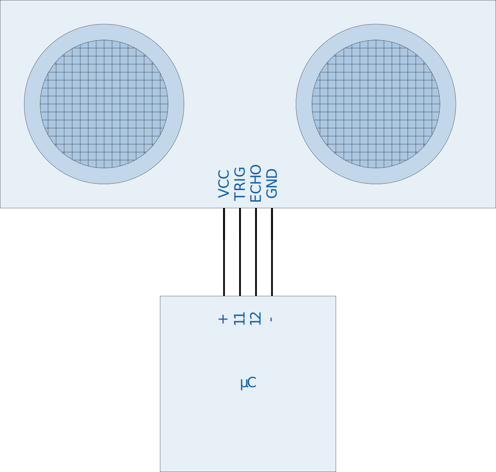

    <h1 class="title">WIP - Knoppen</h1>
    <h2 class="subtitle">Programma's starten m.b.v. knoppen</h2>
    

        

            <h3 class="info_item_title">In het echt</h3>
            

                </img>
            

        

        

            <h3 class="info_item_title">Type</h3>
            

                Invoer 
            

        

        

            <h3 class="info_item_title">Pinnen</h3>
            

                <table>
                    <tr><td>VCC</td><td>De 5 V-voeding, soms ook aangeduid met een +.</td></tr>
                    <tr><td>GND</td><td>De referentiespanning of de grond, soms ook aangeduid met een -.</td></tr>
                    <tr><td>PIN</td><td>...</td></tr>
                    <tr><td>PIN</td><td>...</td></tr>
                    <tr><td>PIN</td><td>...</td></tr>
                </table>
            

        

        

            <h3 class="info_item_title">Werking</h3>
            

                Op de dwenguino vind je vijf drukknoppen. De buitenste knoppen kregen de namen NOORD, ZUID, OOST, WEST, net als in aardrijkskunde. De middelste knop heet MIDDEN. 
                 
                Je kan deze gebruiken om bepaalde delen van je programma niet te laten uitvoeren tot je dit expliciet aangeeft door een knop in te drukken.
            

        

        

            <h3 class="info_item_title">Symbool</h3>
            

                
            

        

        

            <h3 class="info_item_title">Aansluiting</h3>
            

                
            

        

        

            <h3 class="example_item_title">Voorbeeld: led 0 gaat pas branden wanneer je een knop indrukt.</h3>
            

<pre>
<code class="language-arduino">
    
    #include <Wire.h>
    #include <Dwenguino.h>
    #include <LiquidCrystal.h>

    void setup(){
        initDwenguino();
    }

    void loop(){
        if (digitalRead(SW_N) == PRESSED) {
            pinMode(32, OUTPUT);
            digitalWrite(32, HIGH);
        }
    }
</code>
</pre> 
            

        

    

