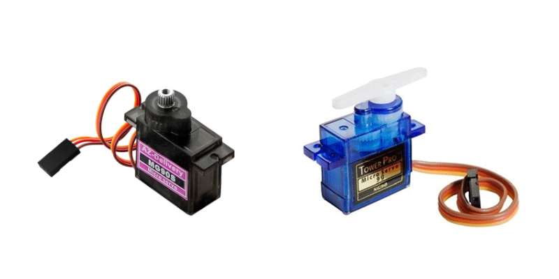

    <h1 class="title">WIP - 180° servomotor</h1>
    <h2 class="subtitle">Rotaties uitvoeren</h2>
    

        

            <h3 class="info_item_title">In het echt</h3>
            

                </img>
            

        

        

            <h3 class="info_item_title">Type</h3>
            

                Uitvoer, digitale actuator 
            

        

        

            <h3 class="info_item_title">Pinnen</h3>
            

                <table>
                    <tr><td>GND</td><td>De referentiespanning of de grond, soms ook aangeduid met een -.</td></tr>
                    <tr><td>VCC</td><td>De 5 V-voeding, soms ook aangeduid met een +.</td></tr>
                    <tr><td>PIN</td><td>...</td></tr>
                </table>
            

        

        

            <h3 class="info_item_title">Werking</h3>
            

                Je beschikt over 2 soorten: 
                 
                - *De blauwe servomotor*: Deze servomotor kan slechts 180 graden draaien. Je kan deze m.a.w. gebruiken om een halve draaibeweging uit te voeren.
                - *De zwarte servomotor*: Deze servomotor kan 360 graden draaien. Deze gebruik je bijvoorbeeld om iets constant te laten draaien. 
                 
                Het voordeel van de blauwe servomotor t.o.v. de zwarte servomotor is dat je de positie (de draaihoek) exact kunt bepalen. Hij is dus beter voor precieze bewegingen. Het nadeel is dan weer dat het wat ingewikkelder is om deze te programmeren
        

        

            <h3 class="info_item_title">Symbool</h3>
            

                
            

        

        

            <h3 class="info_item_title">Aansluiting</h3>
            

                
            

        

        

            <h3 class="example_item_title">Voorbeeld: 2 servomotoren bewegen herhaaldelijk op en neer zoals armen die zwaaien.</h3>
            

<pre>
<code class="language-arduino">
    
    #include <Wire.h>
    #include <Dwenguino.h>
    #include <LiquidCrystal.h>
    #include <Servo.h>

    Servo servoOnPin19;
    Servo servoOnPin18;

    void setup(){
        initDwenguino();
    }

    void loop(){
        servoOnPin19.attach(19);
        servoOnPin19.write(0);
        servoOnPin18.attach(18);
        servoOnPin18.write(0);
        delay(1000);
        servoOnPin19.attach(19);
        servoOnPin19.write(180);
        servoOnPin18.attach(18);
        servoOnPin18.write(180);
        delay(1000);
    }
</code>
</pre> 
            

        

    

