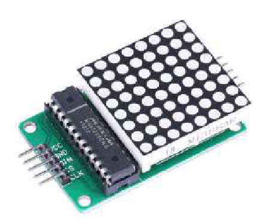

    <h1 class="title">Led-matrix</h1>
    <h2 class="subtitle">Figuren tonen op de led-matrix</h2>
    

        

            <h3 class="info_item_title">In het echt</h3>
            

                </img>
            

        

        

            <h3 class="info_item_title">Type</h3>
            

                Uitvoer, digitale actuator 
            

        

        

            <h3 class="info_item_title">Pinnen</h3>
            

                <table>
                    <tr><td>VCC</td><td>De 5 V-voeding, soms ook aangeduid met een +.</td></tr>
                    <tr><td>GND</td><td>De referentiespanning of de grond, soms ook aangeduid met een -.</td></tr>
                    <tr><td>D</td><td>...</td></tr>
                    <tr><td>CS</td><td>...</td></tr>
                    <tr><td>CLK</td><td>...</td></tr>
                </table>
            

        

        

            <h3 class="info_item_title">Werking</h3>
            

                De led-matrix is een vierkante 8x8 matrix met 64 leds in een vaste kleur (rood). De matrix is ideaal om bepaalde patronen te laten oplichten, zoals een oog of een mond van de robot of een ander symbool. Je kan de matrices ook met elkaar verbinden (maximaal 4), als je meerdere matrices tegelijk wil gebruiken. Je kan programmeren welke leds er tegelijk moeten oplichten.
            

        

        

            <h3 class="info_item_title">Symbool</h3>
            

                
            

        

        

            <h3 class="info_item_title">Aansluiting</h3>
            

                
            

        

        

            <h3 class="example_item_title">Voorbeeld: led laten branden als sonar-sensor object detecteert tot een afstand van 100cm.</h3>
            

<pre>
<code class="language-arduino">
    
    #include <Wire.h>
    #include <Dwenguino.h>
    #include <LiquidCrystal.h>
    #include <LedController.hpp>

    auto led_matrix = LedController<4,1>();
    ByteBlock pattern = {};

    void setup(){
        initDwenguino();

        auto conf = controller_configuration<4,1>();
        conf.useHardwareSpi = false;
        conf.SPI_CLK = 13;
        conf.SPI_MOSI = 2;
        conf.SPI_CS = 10;
        led_matrix.init(conf);
        led_matrix.activateAllSegments();
        led_matrix.setIntensity(8);
        led_matrix.clearMatrix();
    }

    void loop(){
        pattern = {B00000000,B01100110,B11111111,B11111111,B01111110,B00111100,B00011000,B00000000};
        led_matrix.displayOnSegment(0, pattern);
    }
</code>
</pre> 
            

        

    

