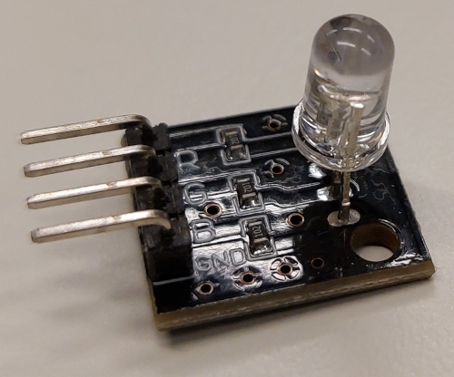

    <h1 class="title">RGB-led</h1>
    <h2 class="subtitle">Verschillende kleuren maken</h2>
    

        

            <h3 class="info_item_title">In het echt</h3>
            

                </img>
            

        

        

            <h3 class="info_item_title">Type</h3>
            

                Uitvoer, digitale actuator 
            

        

        

            <h3 class="info_item_title">Pinnen</h3>
            

                <table>
                    <tr><td>R</td><td>De digitale pin die instaat voor de intensiteit van het rode licht.</td></tr>
                    <tr><td>G</td><td>De digitale pin die instaat voor de intensiteit van het groene licht.</td></tr>
                    <tr><td>B</td><td>De digitale pin die instaat voor de intensiteit van het blauwe licht.</td></tr>
                    <tr><td>GND</td><td>De referentiespanning of de grond, soms ook aangeduid met een -.</td></tr>
                </table>
            

        

        

            <h3 class="info_item_title">Werking</h3>
            

                De RGB-led is een led waarvan je de kleur van het licht zelf kan bepalen door de intensiteit van rood, groen en blauw licht (de primaire kleuren) te programmeren. De intensiteit wordt doorgegeven als een getal tussen 0 en 255 (van lage tot hoge intensiteit). Houd er rekening mee dat niet alle kleuren even goed kunnen wordenweergegeven op de RGB-led via het RGB-kleurenmodel (bv. bruin).
            

        

        

            <h3 class="example_item_title">Voorbeeld: het RGB-led in een kleur naar keuze doen branden.</h3>
            

<pre>
<code class="language-cpp">
    
    const int PIN_RED   = 5;
    const int PIN_GREEN = 6;
    const int PIN_BLUE  = 9;

    void setup() {
        pinMode(PIN_RED,   OUTPUT);
        pinMode(PIN_GREEN, OUTPUT);
        pinMode(PIN_BLUE,  OUTPUT);
    }

    void loop() {
        // color code #00C9CC (R = 0,   G = 201, B = 204)
        analogWrite(PIN_RED,   0);
        analogWrite(PIN_GREEN, 201);
        analogWrite(PIN_BLUE,  204);

        delay(1000); // keep the color 1 second

        // color code #F7788A (R = 247, G = 120, B = 138)
        analogWrite(PIN_RED,   247);
        analogWrite(PIN_GREEN, 120);
        analogWrite(PIN_BLUE,  138);

        delay(1000); // keep the color 1 second

        // color code #34A853 (R = 52,  G = 168, B = 83)
        analogWrite(PIN_RED,   52);
        analogWrite(PIN_GREEN, 168);
        analogWrite(PIN_BLUE,  83);

        delay(1000); // keep the color 1 second
    }
</code>
</pre> 
            

        

    

