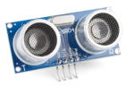

    <h1 class="title">SONAR-SENSOR</h1>
    <h2 class="subtitle">Een afstand meten</h2>
    

        

            <h3 class="info_item_title">In het echt</h3>
            

                </img>
            

        

        

            <h3 class="info_item_title">Type</h3>
            

                Invoer, digitale sensor 
            

        

        

            <h3 class="info_item_title">Pinnen</h3>
            

                <table>
                    <tr><td>VCC</td><td>De 5 V-voeding, soms ook aangeduid met een +.</td></tr>
                    <tr><td>GND</td><td>De referentiespanning of de grond, soms ook aangeduid met een -.</td></tr>
                    <tr><td>TRIG</td><td>De Trigger pin. Deze pin geeft aan wanneer de ultrasone sensor moet beginnen te meten. </td></tr>
                    <tr><td>ECHO</td><td>De echo pin. Deze pin geeft aan wanneer het weerkaatste, ultrasone signaal ontvangen is.</td></tr>
                </table>
            

        

        

            <h3 class="info_item_title">Werking</h3>
            

                De sensor stuurt een ultrasoon geluidssignaal uit. Indien er een voorwerp binnen bereik is, zal deze ultrasone geluidsgolf op dit voorwerp weerkaatsen. Je kan de werking vergelijken met de echolocatie van vleermuizen. Door de tijd te meten tussen het verzenden van het geluidssignaal en het ontvangen van de weerkaatste straal, kan de sensor de afstand tot het object nauwkeurig bepalen. De afstand wordt teruggegeven in cm.
            

        

        

            <h3 class="info_item_title">Symbool</h3>
            

                
            

        

        

            <h3 class="info_item_title">Aansluiting</h3>
            

                
            

        

        

            <h3 class="example_item_title">Voorbeeld: led laten branden als sonar-sensor object detecteert tot een afstand van 100cm.</h3>
            

<pre>
<code class="language-arduino">
    
    #include <Wire.h>
    #include <Dwenguino.h>
    #include <LiquidCrystal.h>
    #include <NewPing.h>

    #define TRIGGER_PIN 11
    #define ECHO_PIN 12
    #define MAX_DISTANCE 200

    NewPing sonar(
        TRIGGER_PIN, 
        ECHO_PIN, 
        MAX_DISTANCE);
    int afstand;

    void setup(){
        initDwenguino();
        pinMode(13, OUTPUT);
    }

    void loop(){
        afstand = sonar.ping_cm();
        if (afstand > 0 && afstand < 100){
            digitalWrite(13, HIGH);
        } else {
            digitalWrite(13, LOW);
        }
        delay(100);
    }
</code>
</pre> 
            

        

    

