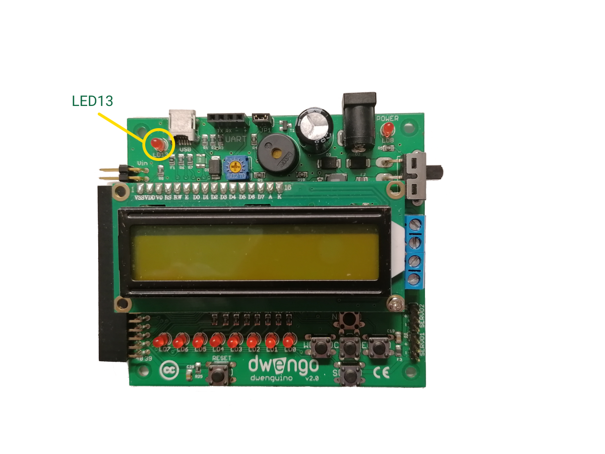

    <h1 class="title">LED13</h1>
    <h2 class="subtitle">Het lampje waarmee je alles kan testen.</h2>
    

        

            <h3 class="info_item_title">In het echt</h3>
            

                </img>
            

        

        

            <h3 class="info_item_title">Type</h3>
            

                Uitvoer, actuator 
            

        

        

            <h3 class="info_item_title">Pinnen</h3>
            

                De naam van de LED geeft het al weg, deze is verbonden met <strong>pin 13</strong> van de microcontroller. 
            

        

        

            <h3 class="info_item_title">Werking</h3>
            

                Leds bestaan in verschillende kleuren. De ingebouwde leds op de Dwenguino kan je rood laten oplichten. Door de pin waarmee de LED verbonden is op hoog te zetten, gaat de LED branden. Merk op dat wanneer je een LED aansluit op een pin van de µC (5V), je steeds een weerstand van ongeveer 400 Ohm in serie moet schakelen met de LED. De exacte waarde van de weerstand hangt af van het type LED die je gebruikt. Voor de LEDs op het Dwenguino bord is al een weerstand van 470 Ohm voorzien. Vind je die terug op het bord?
            

        

        

            <h3 class="info_item_title">Symbool</h3>
            

                
            

        

        

            <h3 class="info_item_title">Aansluiting</h3>
            

                
            

        

        

            <h3 class="example_item_title">Voorbeeld: led 13 laten branden</h3>
            

                <pre><code class="language-arduino">

    #include <Wire.h>
    #include <Dwenguino.h>
    #include <LiquidCrystal.h>
    #include <NewPing.h>

    #define TRIGGER_PIN 11
    #define ECHO_PIN 12
    #define MAX_DISTANCE 200

    NewPing sonar = NewPing(
        TRIGGER_PIN,
        ECHO_PIN,
        MAX_DISTANCE);
    int afstand;

    void setup(){
        initDwenguino();
        pinMode(13, OUTPUT);
    }

    void loop(){
        afstand = sonar.ping_cm();
        if (afstand > 0 && afstand < 100){
            digitalWrite(13, HIGH);
        } else {
            digitalWrite(13, LOW);
        }
        delay(100);
    }

</code></pre> 
            

        

    

