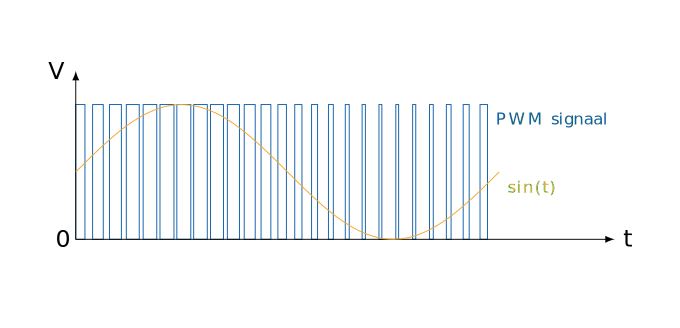

# Analoge uitvoer

De µC kan eigenlijk geen analoge uitvoer genereren. Om dat in bepaalde situaties te "simuleren" kan je gebruik maken van een PWM signaal. PWM staat voor Pulse Width Modulation ofwel pulsbreedtemodulatie. De microcontroller zal pulsen uitsturen. Een puls bestaat uit een tijdsinterval waarin het uitgestuurde signaal 1 (5V) is en een interval waarin het uitgestuurde signaal 0 is (0V). Door de lengte van deze twee intervallen te variëren, kan je de verhouding tussen de tijd dat het signaal hoog is en de tijd dat het signaal laag is veranderen. Als je dat heel snel doet dan krijg je een uitgemiddeld signaal tussen de 0V en 5V.

De µC heeft speciale schakelingen die in staat zijn om een voltage op een pin om te zetten naar een getal. Deze schakeling zal een voltage tussen 0V en 5V registreren en omzetten naar een binair getal van 10 bits. Dit getal kunnen we in onze code dan lezen met de analogRead() functie van de arduino bibliotheek.

| 
| -- |
| In deze grafiek zien we hoe we aan de hand van een PWM signaal een analoge waarde kunnen benaderen. De oranje lijn geeft de spanning weer die in de tijd varieert volgens de functie sin(t). Om deze te benaderen passen we de breedte van de pulsen aan zodat de gemiddelde waarde van het blauwe PWM signaal overeenkomt met de waarde van sin(t). Wanneer sin(t) hoog is, zullen de pulsen lang hoog blijven. Wanneer de waarde van sin(t) laag is, zullen de pulsen maar heel kort hoog blijven. |

<h2>Opdracht</h2>

Probeer LED 13 op de microcontroller te dimmen 50% door er een PWM signaal naar te sturen. Dat PWM signaal is de helft van de tijd 1 en de andere helft 0.

