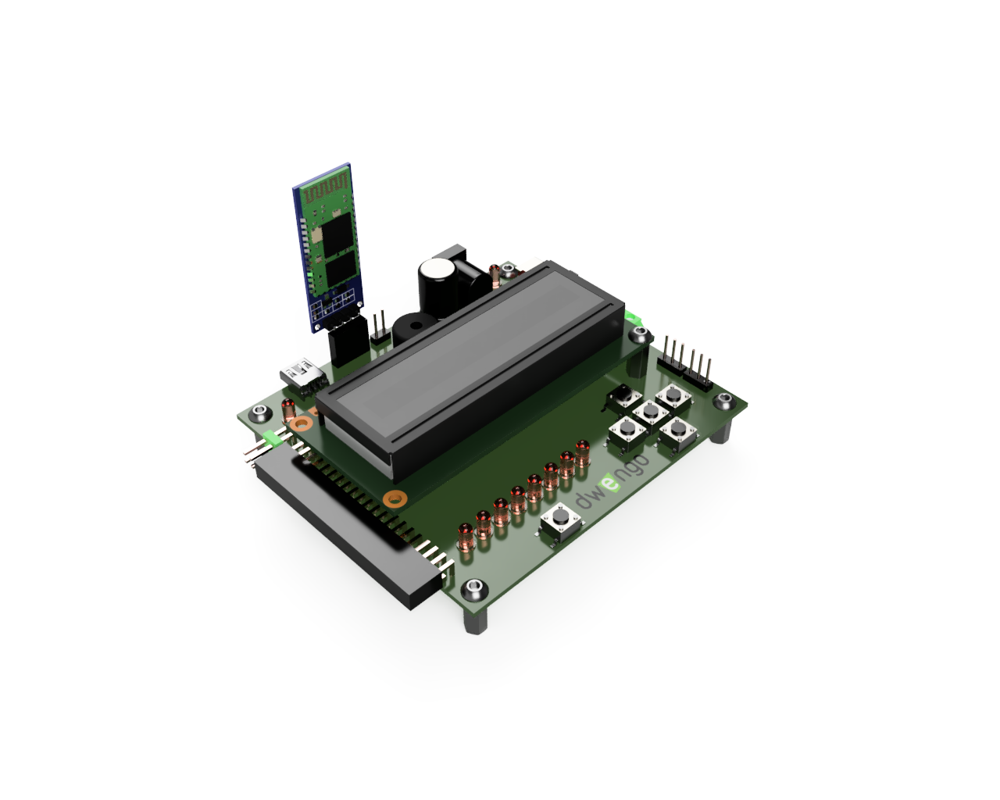

# De opstelling

We zullen gebruik maken van een sonar-sensor om het verloop van een valbeweging te registreren. Een sonar-sensor meet de afstand tot het object dat ervoor staat. In dit experiment, monteren we de sonar-sensor op de rand van een tafel. De sensor kijkt naar beneden en meet de afstand tot de grond. Wanneer we nu een object onder de sensor houden en dit object laten vallen, zal de sensor het verloop van de valbeweging registreren. Je kan eventueel een papieren, kartonnen of pvc buis gebruiken om het object in te laten vallen. Zo zal het gemakkelijker zijn om ervoor te zorgen dat het object mooi naar beneden valt.

TODO: afbeelding tafel met aan de rand een sensor.

## De elektronica

Om metingen te kunnen doen, voegen we twee componenten toe aan de Dwenguino. Een Bluetooth module en een sonar sensor. De Bluetooth module kan je aansluiten op de UART connector bovenaan de Dwenguino (zie onderstaande afbeelding). Zorg dat de pinnen op de module overeen komen met de pinnen op het Dwenguino bord.

De sonar-sensor kan je via het breadboard verbinden met de correcte pinnen van de Dwenguino. Op het onderstaande schema kan je zien hoe je dat moet doen.

