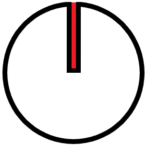

# HDD-klok

## Een digitaal systeem

Met behulp van een Dwenguino en enkele extra onderdelen kan je zelf een HDD klok programmeren. 

Een HDD klok is zoals de naam al verklapt een klok. Wat deze uniek maakt, is dat deze met behulp van LED lampjes en een snel draaiende schijf de illusie geeft van klok-wijzers die de tijd aangeven, net zoals bij een analoge klok.  

Het principe gaat als volgt; de klok maakt gebruik van een spindelmotor om een schijf, waar een smalle gleuf in gemaakt is, aan hoge snelheid te doen draaien. De smalle gleuf laat ons toe om LED-lampjes achter deze schijf te zien. Doordat de schijf zo snel draait en de ledlampjes net branden wanneer de smalle gleuf in de juiste positie staat, lijkt het alsof er wijzers weergegeven worden. 

Een vereenvoudigde, vertraagde weergave voor een schijf die de illusie geeft van een analoge wijzer om 12 uur is als volgt:
</img>  

***

Om een eenvoudige HDD klok te bouwen, gebruik je een Dwenguino die verbonden is aan een spindelmotor, een LED-strip en een snelheidssensor. De Dwenguino zal de spindelmotor met de schijf aan een hoge snelheid doen draaien en de LED-strip op het gepaste moment laten branden. De snelheidssensor wordt gebruikt om te weten waar de gleuf zich bevind op de schijf zodat de LED-lampjes juist getimed worden.

