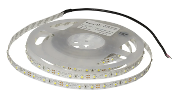

# HDD klok

## Componenten

<h2 class="title">Uitleg componenten</h2>

De uitleg over de componenten die je hieronder terugvindt, bevat informatie te vinden in <a href="/learning-path.html?hruid=pc_starttodwenguino&language=nl&te=true"><strong>het leerpad StartToDwenguino</strong></a>. Indien je dit nog niet hebt doorlopen of nog extra informatie wilt, kan je <a href="/learning-path.html?hruid=pc_starttodwenguino&language=nl&te=true"><strong>hier</strong></a> terecht voor een meer uitgebreide uitleg.  

Om met de Dwenguino een HDD klok te maken, zal je gebruik maken van 4 onderdelen:

- Lcd-scherm
- Spindelmotor
- Ledstrip
- Snelheidssensor

    <h1 class="title">Beschrijving componenten</h1>
    

        

            <h3 class="info_item_title">Lcd-scherm</h3>
            
    
            </img> 
            Het lcd-scherm kan tekst weergeven. Hiermee kan bijvoorbeeld een boodschap worden meegedeeld.
            Op het lcd-scherm van de Dwenguino passen maximaal 32 karakters, zoals letters of cijfers, verspreid over twee regels. Je kan dus 16 karakters per regel tonen. 
            In deze oefening wordt het LCD-scherm gebruikt om weer te geven dat de microcontroller bezig is met de HDD klok. 
            

        

        

            <h3 class="info_item_title">Spindelmotor</h3>
            

            </img> 
            Een spindelmotor kan gebruikt worden om een schijf te doen draaien en is een onderdeel van een harde schijf, ook wel een HDD genoemd. Het is ook daarom dat we deze klok een HDD klok noemen. Een harde schijf wordt normaal gezien gebruikt om geheugen te voorzien in een computer.  
            Tijdens deze oefening maken we gebruik van een spindelmotor om een schijf met een smalle gleuf aan een hoge snelheid te laten bewegen.
            

        

        

            <h3 class="info_item_title">LED-strip</h3>
            

            </img> 
            We sluiten bovendien ook een ledstrip aan op de Dwenguino. Een LED-strip is een lint dat meerdere LED-lampjes kan bevatten. We kunnen deze lampjes op hun beurt aansturen om visuele effecten te verkijgen. 
            Tijdens deze oefening maken we gebruik van de LED-strip om op het gepaste moment een bepaalde kleur te laten schijnen. Zo kan dit in combinatie met de gleuf in de draaiende schijf de illusie geven van klokwijzers.
            

        

        

            <h3 class="info_item_title">Snelheidssensor</h3>
            

            </img> 
                Deze sensor meet snelheid door na te gaan in welke mate een infrarood signaal al dan niet doorgelaten wordt. Doordat we hierdoor de snelheid van de schijf kunnen nagaan weten we ook wanneer bepaalde LED-lampjes moeten branden zodat deze een gepast uur kunnen aanduiden. 
            

        

    

