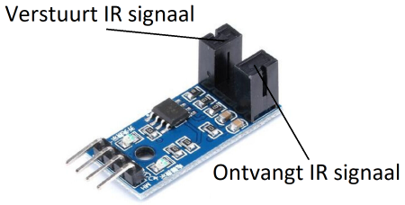

# HDD klok

## Snelheidssensor

</img>

Een snelheidssensor meet de snelheid van een motor, maar hoe gebeurt dit? De sensor bestaat hierbij uit twee belangrijke onderdelen; het eerste onderdeel stuurt een infrarood signaal uit, het tweede onderdeel vangt dit signaal dan weer op. Dit zorgt voor een connectie tussen de twee onderdelen. Wanneer een object tussen deze onderdelen komt, dan is deze connectie onderbroken en stuurt de sensor een signaal uit naar de Dwenguino. Door de tijd te meten tussen opeenvolgende signalen, kunnen we nagaan hoe snel het object tussen deze twee onderdelen beweegt. 

***

Hoe je de snelheidssensor gebruikt, leer je in het volgende leerobject.