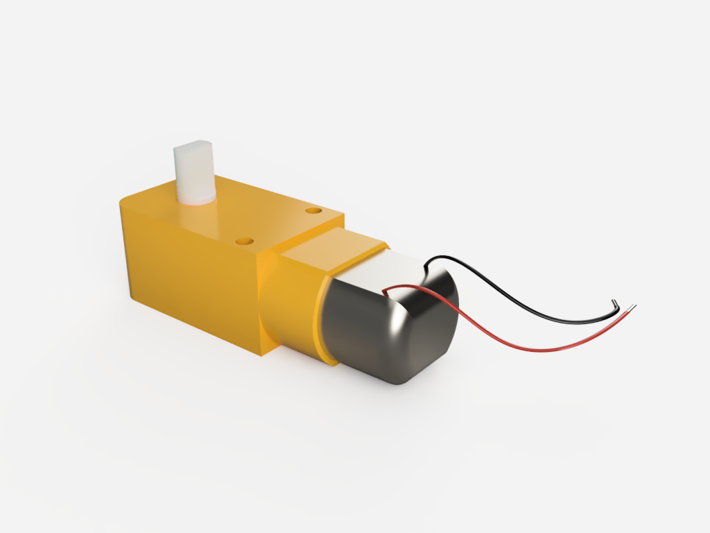
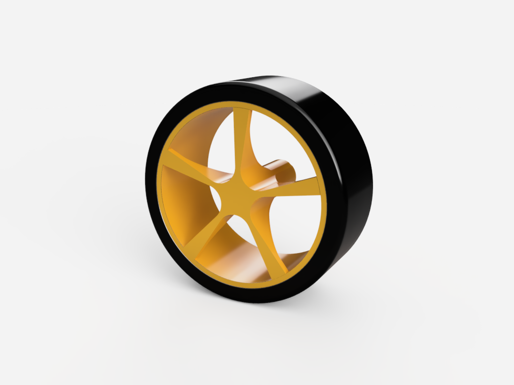
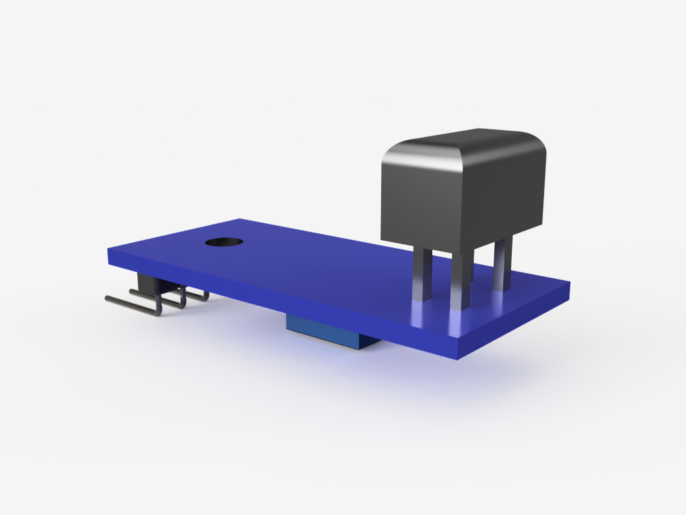
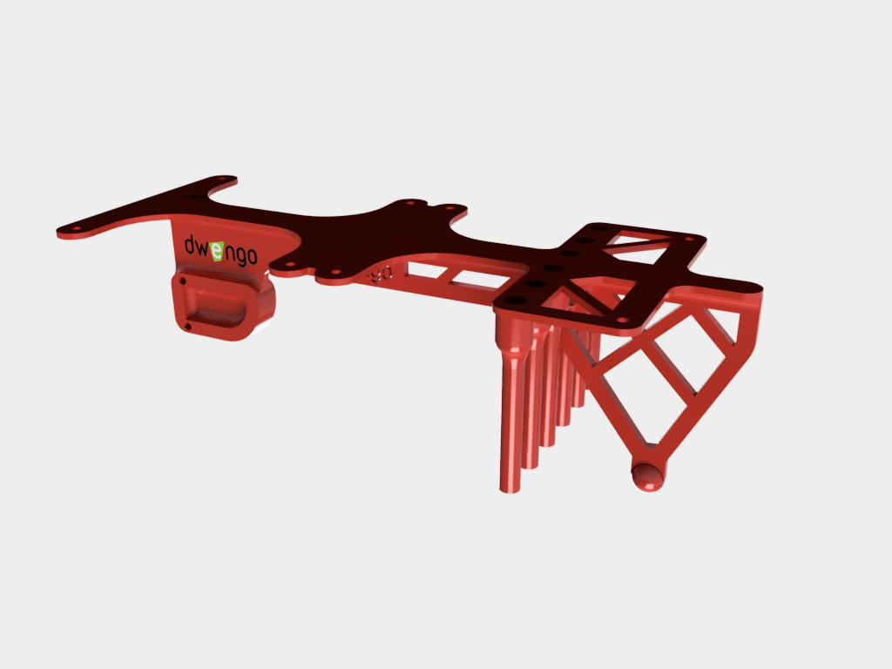

# De Componenten

Voor dit project heb je de volgende componenten nodig:

<table>
    <tr>
        <th>Component</th>
        <th>Aantal</th>
        <th>Afbeelding</th>
    </tr>
    <tr>
        <td>dc-motor</td>
        <td>2</td>
        <td></img></td>
    </tr>
    <tr>
        <td>Wiel</td>
        <td>2</td>
        <td></img></td>
    </tr>
    <tr>
        <td>Grondsensor</td>
        <td>6</td>
        <td></img></td>
    </tr>
    <tr>
        <td>Chassis</td>
        <td>1</td>
        <td></img></td>
    </tr>
    <tr>
        <td>M3 bouten 50mm</td>
        <td>6</td>
        <td></img></td>
    </tr>
    <tr>
        <td>M3 bouten 5mm</td>
        <td>8</td>
        <td></img></td>
    </tr>
    <tr>
        <td>M3 moeren</td>
        <td>6</td>
        <td></img></td>
    </tr>
    <tr>
        <td>Male-Female kabels</td>
        <td>6x3</td>
        <td></img></td>
    </tr>
</table>

