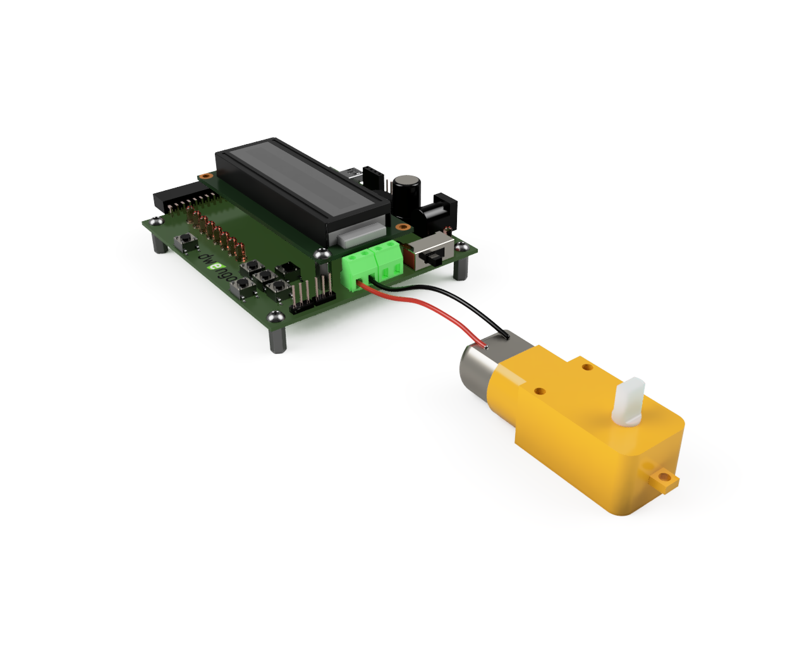

# Het ontwerp

Om de robot makkelijk te kunnen bouwen in de klas, ontwierpen we bij Dwengo een frame dat je makkelijk kan 3D printen. Je kan het ontwerp <a href="/assets/files/physical_computing/chassis_v6.stl">hier</a> downloaden. Het bestand bevat een 3D model in STL formaat. Dergelijke modellen kan je importeren in de slicer software van je 3D printer. Zo kan je de gepaste G-code genereren om het ontwerp op jou printer te printen.

## Bouwen van de robot

Hieronder zie je een afbeelding van hoe je de robot in elkaar moet steken. Probeer op basis van de afbeelding de onderdelen correct te verbinden met de nodige bouten en moeren. Maak **eerst de motoren en sensoren vast** aan het frame. Daarna kan je de Dwenguino vastmaken.

</img>

TODO: filmpje bouwen.

## Aansluiten van de elektronica

On ze rijdende robot heeft maar drie verschillende soorten van elektronische componenten. DC-motoren, grondsensoren en een Bluetooth module. Hieronder beschrijven we hoe je elke component kan aansluiten op de dwenguino.

### De motoren

DC-motoren hebben twee draden. Deze moet je verbinden met de groene schroefterminal aan de rechterkant van het Dwenguino bord. De draden van de linkse motor sluit je aan op de linkse twee schroefterminals. De draden van de rechtse motor, op de rechtse twee schroefterminals. Hieronder zie je een voorbeeld van hoe je een motor moet aansluiten.

</img>